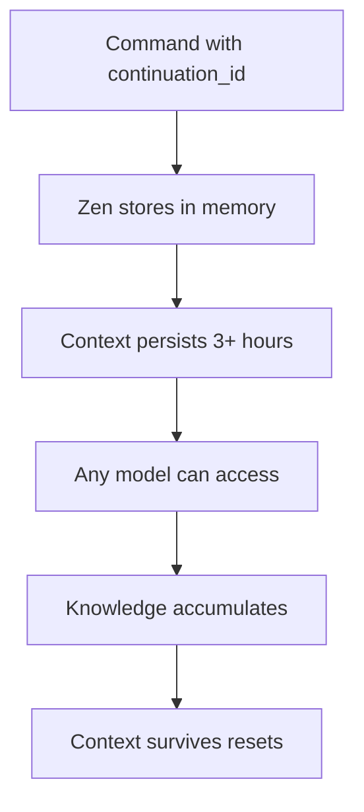

# /context

---
allowed-tools: mcp__zen__chat(*), Read(*), Write(*), Bash(*), Glob(*), Grep(*), mcp__wait__wait_minutes(*)
description: Manage and query Zen context continuity threads for persistent multi-agent knowledge
---

Manage context continuity across agents, commands, and sessions using Zen's powerful continuation system.

## The Power of Context Continuity

Zen's continuation system enables:
- **Persistent Context**: Knowledge survives Claude's context resets
- **Cross-Agent Sharing**: Parallel agents access shared discoveries
- **Session Recovery**: Resume complex investigations days later
- **Knowledge Accumulation**: Build on previous findings seamlessly

## Commands

### List Active Contexts
```bash
/context list
```
Shows all active continuation threads from current epic and recent investigations.

### Query Specific Context
```bash
/context query "epic-genie-context-automation-a3f4b2c1"
```
Retrieves all findings, decisions, and accumulated knowledge from a continuation thread.

### Share Context Between Tasks
```bash
/context share from="T-001" to="T-003"
```
Explicitly shares discoveries from one task with another (within same epic).

### Create Checkpoint
```bash
/context checkpoint "investigation-memory-leak"
```
Saves current context state for later revival. Useful before Claude context resets.

### Resume from Checkpoint
```bash
/context resume "investigation-memory-leak"
```
Restores previous investigation state, re-igniting Claude's understanding.

### View Thread History
```bash
/context history "epic-automagik-v2-3f4a2b"
```
Shows chronological history of all interactions within a continuation thread.

## How It Works

### Context Preservation Flow


### Implementation Details

```python
# List active contexts
if command == "list":
    epic_status = Read("genie/active/epic-status.md")
    contexts = extract_continuation_ids(epic_status)
    
    # Also check recent commands for active threads
    recent_threads = scan_recent_continuations()
    
    return format_context_list(contexts + recent_threads)

# Query specific context
elif command == "query":
    continuation_id = args.split()[1]
    
    # Use Zen to retrieve full context
    summary = mcp__zen__chat(
        continuation_id=continuation_id,
        prompt="Summarize all findings, decisions, and discoveries in this context thread. Include key insights, architectural decisions, identified risks, and next steps.",
        model="o3",
        thinking_mode="medium"
    )
    
    return summary

# Share between tasks
elif command == "share":
    from_task = extract_param(args, "from")
    to_task = extract_param(args, "to")
    
    # Get current epic context
    epic_status = Read("genie/active/epic-status.md")
    epic_continuation = extract_epic_continuation(epic_status)
    
    # Query from-task discoveries
    findings = mcp__zen__chat(
        continuation_id=f"{epic_continuation}/{from_task}",
        prompt=f"Summarize key discoveries for {to_task} to build upon",
        model="gemini"
    )
    
    # Share with to-task
    shared = mcp__zen__chat(
        continuation_id=f"{epic_continuation}/{to_task}",
        prompt=f"Context shared from {from_task}: {findings}",
        model="gemini"
    )
    
    return f"Shared context from {from_task} to {to_task}"

# Create checkpoint
elif command == "checkpoint":
    checkpoint_name = args.split()[1]
    
    # Get current active contexts
    contexts = get_active_contexts()
    
    # Save checkpoint file
    checkpoint_data = {
        "name": checkpoint_name,
        "timestamp": datetime.now().isoformat(),
        "contexts": contexts,
        "epic": Read("CLAUDE.md", extract="CURRENT_EPIC")
    }
    
    Write(f"genie/reference/checkpoints/{checkpoint_name}.json", 
          json.dumps(checkpoint_data, indent=2))
    
    return f"Checkpoint '{checkpoint_name}' created"

# Resume from checkpoint
elif command == "resume":
    checkpoint_name = args.split()[1]
    
    # Load checkpoint
    checkpoint = json.loads(
        Read(f"genie/reference/checkpoints/{checkpoint_name}.json")
    )
    
    # Restore each context
    for context_id in checkpoint["contexts"]:
        summary = mcp__zen__chat(
            continuation_id=context_id,
            prompt="Provide comprehensive summary of this investigation",
            model="o3"
        )
        print(f"\nRestored context: {context_id}")
        print(summary)
    
    return f"Resumed from checkpoint '{checkpoint_name}'"
```

## Usage Examples

### Example 1: Epic Task Coordination
```bash
# Agent A discovers architecture pattern
/o3/thinkdeep "Design caching architecture" \
  continuation_id="epic-cache-3f4a2b/T-001"

# Agent B queries Agent A's findings
/context query "epic-cache-3f4a2b/T-001"

# Agent B builds on the discoveries
/gemini "Implement cache based on architecture" \
  continuation_id="epic-cache-3f4a2b/T-002"
```

### Example 2: Investigation Persistence
```bash
# Monday: Start investigation
/planner "Investigate memory leak in agent sessions"
# Creates: investigate-memory-leak-2a3f4b

# Work progresses...
/o3/debug "Trace memory allocation patterns" \
  continuation_id="investigate-memory-leak-2a3f4b"

# Before leaving: checkpoint
/context checkpoint "memory-leak-investigation"

# Wednesday: Resume where you left off
/context resume "memory-leak-investigation"
# All context restored!

/o3 "What memory patterns did we find?"
# O3 remembers everything from Monday!
```

### Example 3: Multi-Model Consensus with Shared Context
```bash
# Create shared investigation thread
INVESTIGATION="evaluate-new-architecture-5f3a2b"

# Each model contributes
/o3/analyze "Security implications" \
  continuation_id="$INVESTIGATION"

/grok/analyze "Performance characteristics" \
  continuation_id="$INVESTIGATION"

/gemini "Scalability assessment" \
  continuation_id="$INVESTIGATION"

# Query accumulated wisdom
/context query "$INVESTIGATION"
# See all perspectives in one place!
```

## Best Practices

### 1. Naming Conventions
- Epic threads: `epic-{epic-id}-{hash}`
- Task threads: `{epic-thread}/T-{number}`
- Investigations: `{verb}-{topic}-{hash}`
- Decisions: `decide-{topic}-{hash}`

### 2. When to Checkpoint
- Before ending a work session
- After major discoveries
- Before context-heavy operations
- When switching focus areas

### 3. Context Hygiene
- Use descriptive continuation IDs
- Don't mix unrelated contexts
- Archive old checkpoints
- Document thread purposes

## Integration with Commands

Most Zen-powered commands support continuation:
```bash
# Planning with context
/planner "Design new feature" continuation_id="plan-feature-3f2a"

# Debugging with context  
/o3/debug "Memory issue" continuation_id="debug-memory-4a3f"

# Consensus with context
/consensus "Approve design" continuation_id="decide-design-5b2c"
```

## Automatic Context Detection

The system attempts to detect and suggest relevant contexts:
```bash
/context
# Shows: "Active epic context detected: epic-automagik-v2-3f4a2b"
# Suggests: "Use 'query' to see current findings"
```

---

**Context is power**: With Zen's continuation system, no discovery is ever lost, no insight forgotten, and no investigation starts from scratch.