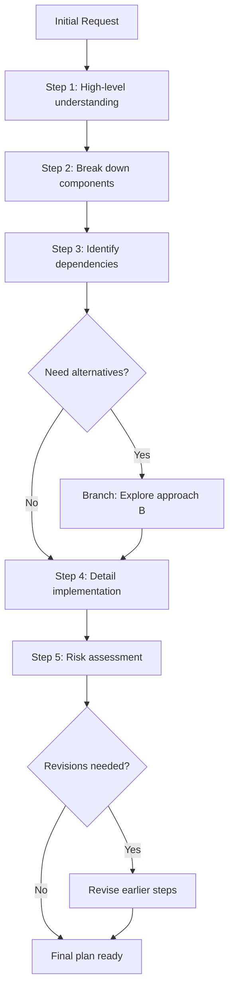

# /planner

---
allowed-tools: mcp__zen__planner(*), Read(*), Write(*), Bash(*), Glob(*), mcp__zen__docgen(*), mcp__wait__wait_minutes(*)
description: Interactive step-by-step planning for complex tasks with branching and revision capabilities
---

Transform vague requirements into concrete, actionable plans through iterative refinement and exploration of alternatives.

## The Power of Interactive Planning

Unlike static planning, the Zen planner enables:
- **Step-by-Step Thinking**: Build plans incrementally with deep reflection
- **Branching Exploration**: Try different approaches without losing progress
- **Dynamic Revision**: Update earlier steps as understanding deepens
- **Forced Reflection**: Complex plans (≥5 steps) trigger deep thinking pauses
- **Context Persistence**: Plans survive across sessions via continuation IDs

## Usage Examples

```bash
# Plan a new feature
/planner "Add real-time collaboration to agent system"

# Plan a complex refactoring
/planner "Refactor routing logic to support dynamic agent registration"

# Plan an investigation
/planner "Investigate and fix memory leak in long-running sessions"

# Plan with specific model
/planner "Design microservices architecture" model="gemini"
```

## How It Works

### Planning Flow


### Deep Thinking Enforcement

For complex plans (≥5 steps), the first 3 steps enforce thinking pauses:
- Prevents surface-level planning
- Ensures thorough consideration of alternatives
- Identifies hidden dependencies early
- Avoids tactical details before strategic decisions

## Automatic Execution

```python
import hashlib
from datetime import datetime

# Generate planning continuation ID
planning_id = f"plan-{hashlib.md5(ARGUMENTS.encode()).hexdigest()[:8]}"

# Initialize planning session
result = mcp__zen__planner(
    continuation_id=planning_id,
    step=f"Create comprehensive plan for: {ARGUMENTS}",
    step_number=1,
    total_steps=5,  # Initial estimate, will adjust
    next_step_required=True,
    model=MODEL or "gemini",  # Good for creative planning
    thinking_mode="high",  # Deep thinking for planning
    use_assistant_model=True
)

# The planner will guide through subsequent steps
```

## Key Features

### 1. Branching
Explore alternative approaches without losing progress:
```python
# Main planning thread
continuation_id="plan-cache-design-3f4a2b"

# Branch to explore Redis approach
branch_id="redis-approach"
is_branch_point=True
branch_from_step=3

# Branch to explore Memcached approach  
branch_id="memcached-approach"
is_branch_point=True
branch_from_step=3
```

### 2. Revision
Update earlier steps as understanding grows:
```python
# Realize step 2 needs adjustment
is_step_revision=True
revises_step_number=2
step="Revised approach based on new constraints discovered"
```

### 3. Dynamic Step Count
Add more steps as complexity emerges:
```python
# Initially estimated 5 steps
total_steps=5

# Complexity emerged, need more steps
total_steps=8
more_steps_needed=True
```

### 4. Context Persistence
Continue planning across sessions:
```bash
# Monday: Start planning
/planner "Design new authentication system"
# Creates: plan-auth-system-4a3f2b

# Wednesday: Continue where left off
/context resume "plan-auth-system-4a3f2b"
/planner continue  # Picks up at last step
```

## Integration with Epic System

When planning is complete, the planner can:

### 1. Generate Epic Document
```python
# After final step
if next_step_required == False:
    epic_doc = mcp__zen__docgen(
        continuation_id=planning_id,
        files_to_document=[plan_summary],
        document_type="epic",
        use_assistant_model=True
    )
```

### 2. Create Task Breakdown
Transform plan steps into epic tasks:
- Each major step becomes a task
- Dependencies are preserved
- Estimates are included
- Context links maintained

### 3. Trigger Spawn-Tasks
Automatically prepare for multi-agent execution:
```bash
# Planning complete
/planner "Design caching system"
# Generates: genie/staging/plan-cache-design-3f4a2b.md

# Review and approve
/epic review

# Spawn tasks with continuation context
/spawn-tasks
```

## Example Planning Session

```bash
/planner "Implement secure file sharing between agents"
```

**Step 1** (High-level understanding):
"I need to understand the security requirements, agent communication patterns, and file types that need sharing."

**Step 2** (Component breakdown):
"Key components: authentication layer, encryption service, file transfer protocol, access control system."

**Step 3** (Identify dependencies):
"Dependencies: existing auth system, network infrastructure, storage backend, compliance requirements."

**Branch Point**: Explore two approaches
- Branch A: "Centralized file server approach"
- Branch B: "Peer-to-peer encrypted transfer"

**Step 4** (Detailed implementation):
"Based on analysis, implementing centralized approach with end-to-end encryption..."

**Step 5** (Risk assessment):
"Security risks: key management, access revocation. Performance risks: large file handling..."

**Revision**: Update Step 2
"Adding audit logging component based on compliance needs discovered in Step 5."

**Final Output**: Complete plan with 7 steps, risk mitigation strategies, and implementation roadmap.

## Best Practices

### 1. Start Broad
Begin with high-level goals before diving into details:
```bash
# Good
/planner "Improve system performance"

# Too specific for initial planning
/planner "Optimize SQL query in user.py line 142"
```

### 2. Embrace Uncertainty
Use branching when multiple approaches seem viable:
- Explore both paths
- Compare trade-offs
- Make informed decisions

### 3. Revise Freely
Don't hesitate to update earlier steps:
- New information changes assumptions
- Better approaches emerge
- Constraints become clearer

### 4. Use Thinking Modes
```bash
# For complex architectural planning
/planner "Design distributed system" thinking_mode="max"

# For straightforward task planning  
/planner "Add logging to API endpoints" thinking_mode="medium"
```

## Output Format

The planner produces:
1. **Step-by-step breakdown** with clear objectives
2. **Dependency graph** showing relationships
3. **Risk assessment** with mitigation strategies
4. **Resource requirements** and estimates
5. **Success criteria** for each component
6. **Alternative approaches** explored via branches

## Integration with Other Commands

```bash
# Plan leads to investigation
/planner "Optimize database performance"
# Output: Need to analyze current bottlenecks

/o3/thinkdeep "Analyze database bottlenecks" \
  continuation_id="plan-db-optimization-3f4a2b"

# Plan leads to consensus
/planner "Migrate to microservices"
# Output: Architecture design ready

/consensus "Approve microservices architecture" \
  continuation_id="plan-microservices-5b2c"
```

---

**Interactive planning**: Transform complex challenges into manageable, well-thought-out action plans with the power of step-by-step thinking and persistent context.