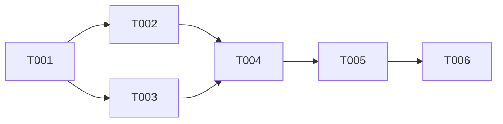

# /spawn-tasks

---
allowed-tools: Task(*), Read(*), Write(*), Edit(*), MultiEdit(*), Glob(*), Grep(*), Bash(*), LS(*), NotebookRead(*), NotebookEdit(*), WebFetch(*), TodoWrite(*), WebSearch(*), ListMcpResourcesTool(*), ReadMcpResourceTool(*), mcp__zen__chat(*), mcp__zen__thinkdeep(*), mcp__zen__planner(*), mcp__zen__consensus(*), mcp__zen__codereview(*), mcp__zen__precommit(*), mcp__zen__debug(*), mcp__zen__secaudit(*), mcp__zen__docgen(*), mcp__zen__analyze(*), mcp__zen__refactor(*), mcp__zen__tracer(*), mcp__zen__testgen(*), mcp__zen__challenge(*), mcp__zen__listmodels(*), mcp__zen__version(*), mcp__search-repo-docs__*, mcp__ask-repo-agent__*, mcp__wait__*, mcp__send_whatsapp_message__*
description: Internal command to spawn task files from epic structure (used by Claude after epic approval)
---

🚧 **DEVELOPMENT MODE** 🚧
Internal command that creates all task files and triggers automation after epic approval.

## Purpose

The `/spawn-tasks` command is the final step in the wish → epic → tasks workflow. It parses the approved epic document and creates all necessary files, updates system state, generates continuation IDs for context persistence, and prepares everything for multi-agent execution with shared knowledge capabilities.

## Workflow Position

```mermaid
graph TD
    A[User approves epic] --> B[/spawn-tasks triggered]
    B --> C[Parse epic document]
    C --> D[Generate continuation IDs]
    D --> E[Create task files with context]
    E --> F[Update CLAUDE.md]
    F --> G[Move files to active/]
    G --> H[Trigger context hooks]
    H --> I[System ready for agents]
```

## What It Does

### 1. Parse Epic Document

Reads the epic from `genie/staging/[epic-id].md` and extracts:
- Epic metadata (ID, type, priority)
- Task list with details
- Dependencies
- Success criteria
- References

### 1.5. Generate Continuation IDs

Creates unique continuation identifiers for context persistence:

```python
import hashlib
from datetime import datetime

# Generate epic continuation ID
epic_id = "genie-context-automation"
timestamp = datetime.now().isoformat()
epic_continuation_id = f"epic-{epic_id}-{hashlib.md5(timestamp.encode()).hexdigest()[:8]}"

# Store in epic metadata
epic_metadata = {
    "continuation_id": epic_continuation_id,
    "created_at": timestamp,
    "epic_id": epic_id
}

# Generate task continuation IDs
for task_num, task in enumerate(tasks, 1):
    task_continuation_id = f"{epic_continuation_id}/T-{task_num:03d}"
    task["continuation_id"] = task_continuation_id
```

### 2. Create Task Files

For each task in the epic, generates:

```markdown
# Task: T-001 - Design reference resolver architecture

## Epic: genie-context-automation
## Continuation ID: epic-genie-context-automation-a3f4b2c1/T-001
## Status: [ ] 📋 TODO
## Dependencies: none
## Estimate: 2-3 hours

## Description
Create extensible system for #epic/#task parsing

## Acceptance Criteria
- Architecture doc with parser design
- Regex patterns defined
- Resolver interface specified

## Technical Context
[Relevant context from epic]

## Context Continuity
When working on this task, use continuation ID for all Zen tool calls:
```python
continuation_id="epic-genie-context-automation-a3f4b2c1/T-001"
```

This enables:
- Knowledge sharing with parallel agents
- Context persistence across sessions
- Access to discoveries from related tasks

## References
- @genie/active/genie-framework-analysis-report.md
- Pattern: @genie/reference/parser-patterns.md

## Implementation Notes
[Space for agent to add notes during work]
```

### 3. Update System State

Updates `CLAUDE.md`:
```xml
<state_configuration>
<!-- UPDATE WHEN SWITCHING EPICS -->
CURRENT_EPIC: "genie-context-automation"
<!-- epic-status.md is always the current epic status file -->
</state_configuration>
```

### 4. Create Epic Status File

Generates `genie/active/epic-status.md`:
```markdown
# Epic Status: Genie Context Automation

## Continuation Thread
Master continuation ID: `epic-genie-context-automation-a3f4b2c1`

## Overview
[From epic document]

## Task Status
- [ ] 📋 T-001: Design reference resolver architecture
- [ ] 📋 T-002: Implement reference parser
- [ ] 📋 T-003: Create context injection hooks
- [ ] 📋 T-004: Integrate with commands
- [ ] 📋 T-005: Add automation triggers
- [ ] 📋 T-006: Create comprehensive tests

## Active Context Threads
- T-001: `epic-genie-context-automation-a3f4b2c1/T-001` (pending)
- T-002: `epic-genie-context-automation-a3f4b2c1/T-002` (pending)
- T-003: `epic-genie-context-automation-a3f4b2c1/T-003` (pending)
- T-004: `epic-genie-context-automation-a3f4b2c1/T-004` (pending)
- T-005: `epic-genie-context-automation-a3f4b2c1/T-005` (pending)
- T-006: `epic-genie-context-automation-a3f4b2c1/T-006` (pending)

## Shared Context Access
Agents can query shared context:
```python
# Check what T-001 discovered
mcp__zen__chat(
    continuation_id="epic-genie-context-automation-a3f4b2c1/T-001",
    prompt="What architectural decisions were made?",
    model="o3"
)

# Access epic-level insights
mcp__zen__chat(
    continuation_id="epic-genie-context-automation-a3f4b2c1",
    prompt="Summarize all discoveries across tasks",
    model="gemini"
)
```

## Dependencies


## Blocked Tasks
[Updated as dependencies are tracked]

## Completed Tasks
[Updated as tasks complete]
```

### 5. File Organization

Moves files to proper locations:
```bash
# Task files to todo/
genie/todo/genie-context-automation_T-001-design-resolver.md
genie/todo/genie-context-automation_T-002-implement-parser.md
...

# Epic file to active/
genie/active/genie-context-automation.md

# Status file in active/
genie/active/epic-status.md

# Archive the staging file
genie/archive/staging/[epic-id]-[timestamp].md
```

### 6. Initialize Patterns

Creates pattern templates in reference/:
```bash
genie/reference/genie-context-automation-patterns.md
```

### 7. Trigger Hooks

Executes hooks for:
- Context injection setup
- Git branch creation (optional)
- Notification of epic start
- Multi-agent coordination setup

## Automation Magic

The real magic happens through hooks:

### `epic-spawn.sh` Hook
```bash
#!/bin/bash
# Triggered when epic lands in staging/

EPIC_FILE=$1
EPIC_ID=$(grep "Epic ID:" $EPIC_FILE | cut -d' ' -f3)

# Update CLAUDE.md
sed -i "s/CURRENT_EPIC: .*/CURRENT_EPIC: \"$EPIC_ID\"/" CLAUDE.md

# Create branch
git checkout -b $EPIC_ID

# Notify
notify.sh "Epic $EPIC_ID ready for work!"
```

### `task-context-injector.sh` Hook
```bash
#!/bin/bash
# Ensures all agents get epic context

TASK_FILE=$1
EPIC_ID=$(grep "Epic:" $TASK_FILE | cut -d' ' -f2)

# Inject epic context
echo "Auto-injected epic context: @genie/active/$EPIC_ID.md" >> $TASK_FILE
```

## Error Handling

Validates before spawning:
- [ ] Epic file exists and is valid
- [ ] No duplicate epic IDs
- [ ] Task IDs are unique
- [ ] Dependencies are valid
- [ ] Required folders exist

## Development Testing

1. **Test parsing**: Can it extract tasks from epic?
2. **Test file generation**: Are task files well-formed?
3. **Test state updates**: Is CLAUDE.md updated correctly?
4. **Test organization**: Do files end up in right places?
5. **Test hooks**: Do automations trigger properly?

## Integration with Context System

All spawned tasks automatically include:
- Reference to parent epic
- Unique continuation ID for context persistence
- Links to relevant patterns
- Context injection markers
- Dependency information
- Instructions for using continuation IDs

This ensures that when an agent picks up a task, they have:
- Everything needed without manual searching
- Ability to share discoveries with parallel agents
- Access to accumulated knowledge from related tasks
- Context that persists across sessions and model switches

### Context Sharing Examples

```bash
# Agent A working on T-001
/o3/thinkdeep "Design caching architecture" \
  continuation_id="epic-cache-design-3f4a2b/T-001"

# Agent B working on T-002 can access T-001's findings
/gemini "Implement cache based on T-001 design" \
  continuation_id="epic-cache-design-3f4a2b/T-002"
# Gemini can query T-001's context!

# Coordinator can see all progress
/context query "epic-cache-design-3f4a2b"
```

---

🚧 **Internal Use Only**: Called by Claude after epic approval, not directly by users.