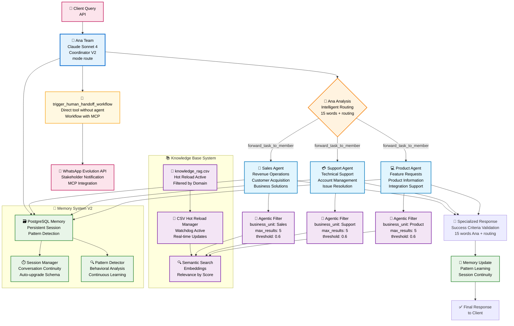

# Automagik Hive - Enterprise Multi-Agent System

A production-ready enterprise framework for building sophisticated multi-agent AI systems with intelligent routing and enterprise-grade deployment capabilities.

## 🏗️ Architecture Overview

The system utilizes a clean architecture with Ana as the central coordinator that analyzes queries and routes them to specialized agents. Each agent has dedicated access to the knowledge base with intelligent filtering for precise and contextual responses.



## 🚀 Quick Start

### Universal Installation (Recommended)

Get started on any machine with our universal installer that handles all dependencies:

```bash
# One-command installation (handles everything)
curl -sSL https://raw.githubusercontent.com/your-org/automagik-hive/main/install.sh | bash

# Or download and run locally
wget https://raw.githubusercontent.com/your-org/automagik-hive/main/install.sh
chmod +x install.sh
./install.sh
```

The installer will:
- ✅ Detect your operating system (Linux, macOS, Windows/WSL)
- ✅ Install Python 3.12+ via uv (if needed)
- ✅ Install all system dependencies (curl, git, openssl, make)
- ✅ Offer optional Docker setup with secure PostgreSQL credentials
- ✅ Run `make install` automatically
- ✅ Validate everything works correctly

### Manual Installation

#### Environment Configuration
```bash
# Copy example file
cp .env.example .env

# Edit .env with your configurations
# HIVE_PORT=9888            # Dynamic port (default: 7777)
# ENVIRONMENT=development   # Development mode
# DEMO_MODE=true           # Rich interface enabled
```

#### Option 1: Local Development
```bash
# Install dependencies (local only)
make install-local

# Start development server
make dev

# Playground: Chat CLI for testing (optional)
python chat.py
```

#### Option 2: Development with Docker PostgreSQL
```bash
# Install with optional Docker PostgreSQL setup
make install

# Start development server
make dev
```

#### Option 3: Production with Docker
```bash
# Setup environment
make install

# Start production stack
make prod

# Check status
make status
```

Available endpoints:
- **API**: http://localhost:9888 (.env configurable, default 7777)
- **Docs**: http://localhost:9888/docs (Swagger UI)
- **Chat CLI**: `python chat.py` (playground/testing)
- **Health**: http://localhost:9888/api/v1/health

## 🤖 Ana Coordinator & Specialized Agents

### V2 Architecture with Ana
The V2 system uses Ana as central coordinator with advanced capabilities:

- **Ana Team Router**: Agno Team with mode="route" for intelligent selection
- **Success Criteria**: Responses ≤15 words + adequate routing
- **Confidence Scoring**: Agent selection based on confidence
- **Context Preservation**: Persistent memory between interactions

### Agents by Business Domain

1. **🏪 Sales**: Revenue operations, customer acquisition, business solutions, deal processing
2. **💳 Support**: Technical support, account management, issue resolution, troubleshooting
3. **💻 Product**: Feature requests, product information, integration support, documentation
4. **🚨 Human Handoff**: Automatic escalation workflow for human assistance with context preservation and WhatsApp notification

## 💬 Rich Chat CLI Interface

### Real-time Interactive Chat
The system includes an advanced chat interface with real-time monitoring:

```bash
# Start chat CLI
python chat.py

# Features:
# - Rich Console interface with split panels
# - Real-time event monitoring
# - Agent selection visualization
# - Success criteria tracking (≤15 words)
# - Live performance metrics
```

### Interface Features
- **Split Panels**: Chat on left, events on right
- **Event Streaming**: Real-time agent activity
- **Success Validation**: Automatic Ana criteria monitoring
- **Rich Formatting**: Markdown and advanced formatting
- **Session Tracking**: Conversation continuity

## 🎯 Knowledge System with Hot Reload

### Intelligent Knowledge Base
- **📄 CSV Hot Reload**: Automatic updates without system restart
- **🎯 Agentic Filters**: Automatic filtering by business_unit
- **🔍 Semantic Search**: Embeddings for contextual relevance
- **⚡ Performance**: Sub-second responses with intelligent cache

### Domain-based Filtering
```
Ana Query: "How to set up integrations?"
↓ Ana Automatic Analysis ↓
Routing: Product Agent
↓ Agentic Filter Applied ↓
- business_unit: "Product"
- max_results: 5
- relevance_threshold: 0.6
↓ Result ↓
Most relevant domain documents
```

### Hot Reload Configuration
```python
# Automatically activated in development
HIVE_CSV_HOT_RELOAD=true

# Watchdog monitors changes in:
# context/knowledge/knowledge_rag.csv
```

## 🧠 Memory System V2

### PostgreSQL + Session Management
- **PostgreSQL Base**: Persistent storage with auto-upgrade
- **Session Continuity**: Context preserved between conversations
- **Pattern Detection**: Continuous learning of behaviors
- **Schema Auto-upgrade**: Automatic migrations via Alembic

### Memory Features
- **User Memories**: Client preferences and context
- **Agentic Memory**: Agent learning
- **Pattern Recognition**: Recurring issue detection
- **Session Tracking**: Conversational state management

## 📱 WhatsApp & MCP Integration

### Evolution API Integration
```
Escalation Detected → trigger_human_handoff_workflow → MCP WhatsApp Tool
                                                    ↓
                                  mcp_send_whatsapp_message → Evolution API
                                                    ↓
                                          WhatsApp Stakeholder Notification
```

### Integration Features
- **MCP Protocol**: Integration via Model Context Protocol
- **Evolution API**: Direct WhatsApp Business connection
- **Context Transfer**: Complete conversation history
- **Real-time Alerts**: Instant notifications

## 🛠️ Tech Stack

### Core Framework
- **🤖 Agno Framework 1.7.1+**: Multi-agent orchestration
- **🧠 Claude Sonnet 4**: Primary AI with thinking mode
- **🐍 Python 3.12+**: Modern runtime with UV
- **⚡ FastAPI 0.116.0+**: REST API with automatic docs

### Data & Persistence
- **🐘 PostgreSQL 16+**: Main database with pgvector
- **📊 SQLAlchemy 2.0+**: Async ORM with migrations
- **📄 CSV Knowledge**: Hot-reload base with RAG
- **🔍 Embeddings**: Advanced semantic search

### Integration & Communication
- **📱 Evolution API**: WhatsApp Business integration
- **🔌 MCP Protocol**: Enhanced agent capabilities
- **⚡ WebSocket**: Real-time monitoring

## 📁 Project Structure

```
automagik-hive/
├── README.md                           # This file
├── CLAUDE.md                           # Development context and patterns
├── Makefile                            # Automation (install, dev, prod, test)
├── chat.py                             # Rich Chat CLI Interface
├── pyproject.toml                      # Python configuration with UV
├── .env                                # Environment configuration (dynamic port)
├── ai/
│   ├── agents/                         # Specialized agents (YAML-driven)
│   │   ├── registry.py                 # Factory and central registry
│   │   ├── sales/                      # Sales specialist
│   │   ├── support/                    # Support specialist
│   │   ├── product/                    # Product specialist
│   │   ├── human_handoff/              # Human escalation
│   │   └── whatsapp_notifier/          # WhatsApp notifications
│   ├── teams/                          # Ana Team Routing V2
│   │   └── ana/                        # Ana Coordinator
│   │       ├── team.py                 # Team(mode="route")
│   │       ├── config.yaml             # Routing configuration
│   │       └── demo_logging.py         # Rich console logging
│   └── workflows/                      # Multi-step workflows
│       ├── conversation_typification/  # Query classification
│       └── human_handoff/              # Escalation process
├── api/                                # FastAPI + Agno interface
│   ├── serve.py                        # Main server
│   ├── main.py                         # FastAPI app
│   ├── routes/                         # Custom endpoints
│   └── monitoring/                     # Monitoring system
├── lib/
│   ├── knowledge/                      # Knowledge and memory
│   │   ├── knowledge_rag.csv           # Domain data
│   │   ├── csv_hot_reload.py           # Hot reload manager
│   │   └── agentic_filters.py          # Domain filters
│   ├── memory/                         # Memory system V2
│   │   ├── memory_manager.py           # PostgreSQL memory
│   │   └── pattern_detector.py         # Pattern detection
│   ├── config/                         # Configuration management
│   └── utils/                          # Shared utilities
├── db/                                 # Database layer
│   ├── migrations/                     # Alembic migrations
│   └── tables/                         # SQLAlchemy models
├── tests/                              # Complete test suite
│   ├── unit/                           # Unit tests
│   ├── integration/                    # Integration tests
│   └── monitoring/                     # Monitoring tests
└── docs/                               # Project documentation
    └── ai-context/                     # AI-specific docs
```

## 🎯 Key Features

### Intelligent Ana Coordinator
- **🎯 Precision Routing**: Ana analyzes and routes with confidence scoring
- **⚡ Success Criteria**: Automatic validation ≤15 words + routing
- **🧠 Context Awareness**: Persistent memory with pattern learning
- **🔄 Intelligent Escalation**: Automatic complexity detection

### Rich Interface & Monitoring
- **💬 Advanced Chat CLI**: Rich Console interface with split panels
- **📊 Real-time Events**: Live agent activity monitoring
- **📈 Live Metrics**: Performance and success criteria in real time
- **🎨 Rich Formatting**: Markdown and advanced formatting

### Dynamic Knowledge System
- **🔄 Hot Reload**: CSV updates without system restart
- **🎯 Agentic Filters**: Automatic filtering by business_unit
- **🔍 Semantic Search**: Contextual relevance with embeddings
- **⚡ Performance**: Sub-second responses with intelligent cache

### Enterprise Integration
- **📱 WhatsApp Evolution**: Notifications via MCP protocol
- **👥 Human Handoff**: Escalation with context preservation
- **🏛️ Compliance**: Audit and enterprise security
- **📊 Analytics**: Detailed metrics and pattern detection

## 🔐 Configuration & Deployment

### Environment Configuration
```bash
# Dynamic configuration via .env
HIVE_ENVIRONMENT=development
HIVE_API_PORT=9888          # Overrides default 7777
HIVE_DEMO_MODE=true         # Rich interface enabled
HIVE_CSV_HOT_RELOAD=true         # Hot reload active

# Required APIs
ANTHROPIC_API_KEY=your-key
OPENAI_API_KEY=your-key
GEMINI_API_KEY=your-key

# Database
HIVE_DATABASE_URL=postgresql+psycopg://ai:ai@localhost:5532/ai

# Optional integrations
EVOLUTION_API_BASE_URL=http://localhost:8080
```

### Development Commands
```bash
# Complete setup
make install

# Development with hot reload
make dev

# Interactive chat CLI
python chat.py

# Production with Docker
make prod

# Status and logs
make status
make logs

# Tests
make test
```

## 📊 Performance & Metrics

### Ana Success Criteria
- **Response Efficiency**: ≤15 words + adequate routing
- **Routing Precision**: Confidence-based agent selection
- **Escalation Rate**: Handoff frequency monitoring
- **Success Rate**: Automatic criteria validation

### System Metrics
- **Response Time**: <500ms average for Ana routing
- **Throughput**: 1000+ requests/minute supported
- **Availability**: 99.9% uptime with health monitoring
- **Concurrent Users**: 1000+ via async architecture

### Monitoring Stack
- **Rich Console**: Development interface with events
- **Health Checks**: Automatic monitoring endpoints
- **Pattern Detection**: Continuous behavioral learning
- **Performance Analytics**: Real-time metrics

---

**Built with Agno Framework V2 + Ana Intelligence**  
**© 2025 - Advanced Multi-Agent System**