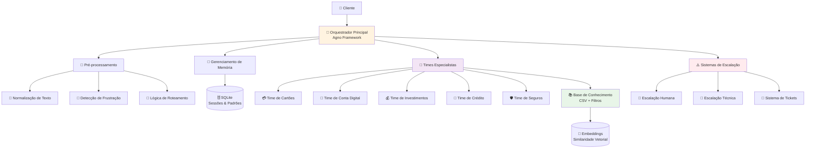
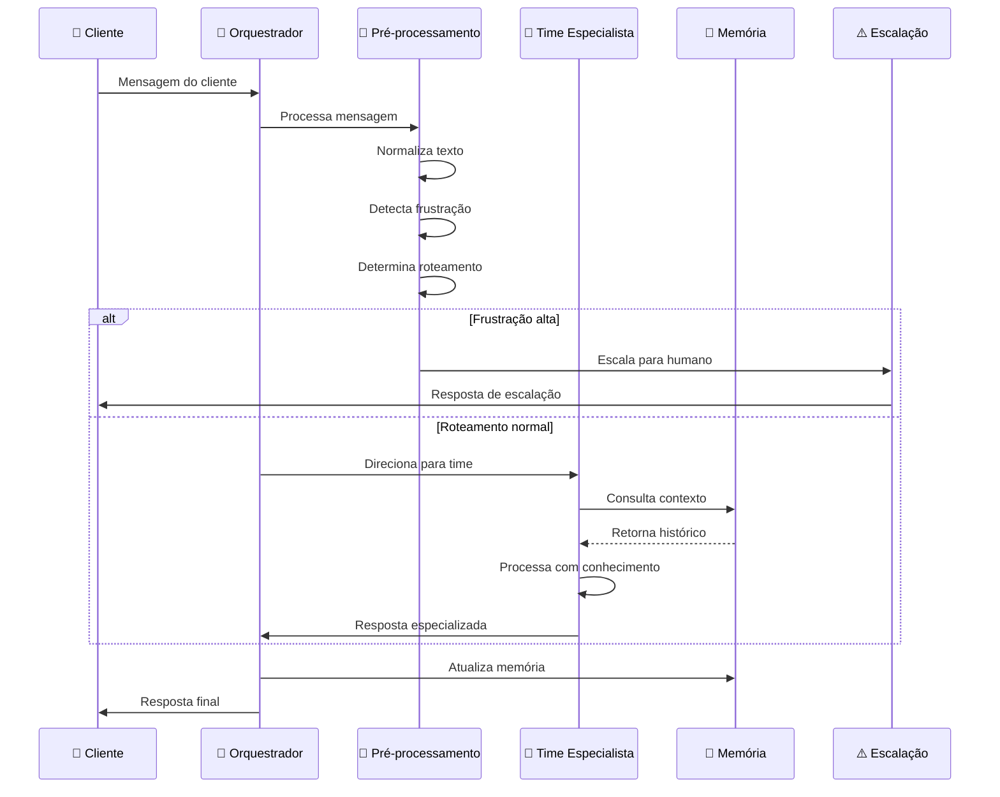

# Sistema Multi-Agente PagBank

Sistema sofisticado de atendimento ao cliente multi-agente desenvolvido com o framework Agno, projetado especificamente para as necessidades do mercado brasileiro do PagBank.

## 🚀 Início Rápido

```bash
uv sync
```

```bash
uv run python playground.py
```

**Interface web opcional (em outro terminal):**
```bash
cd agent-ui
pnpm install
pnpm dev
```

O sistema estará disponível em: http://localhost:7777  
Interface web (opcional): http://localhost:3000

## 📋 Visão Geral do Sistema

O Sistema Multi-Agente PagBank utiliza orquestração avançada de IA para fornecer atendimento ao cliente inteligente em cinco domínios especializados:

### Times Especialistas
- **Time de Cartões** 💳 - Problemas com cartões de crédito/débito, limites, faturas
- **Time de Conta Digital** 🏦 - PIX, transferências, saldo, extratos
- **Time de Investimentos** 💰 - CDB, produtos de investimento, compliance
- **Time de Crédito** 💸 - Empréstimos, FGTS, proteção contra fraudes
- **Time de Seguros** 🛡️ - Produtos de seguro, sinistros, coberturas

### Recursos Principais
- 🇧🇷 Suporte nativo ao português brasileiro com correção de erros de digitação
- 🚨 Detecção avançada de fraudes e prevenção de golpes
- 😤 Detecção de frustração e escalação para atendimento humano
- 🧠 Memória persistente e reconhecimento de padrões
- 📚 Filtragem de conhecimento específico por time
- ⚡ Otimização de tempo de resposta <2s


## 🏗️ Arquitetura

### Visão Geral do Sistema



### Fluxo de Processamento de Mensagens



## 🛠️ Stack Técnico

- **Framework**: Agno (Orquestração Multi-Agente)
- **LLM**: Claude Sonnet 4 (claude-sonnet-4-20250514)
- **Base de Conhecimento**: CSV com embeddings PgVector
- **Memória**: Agno Memory v2 com SqliteMemoryDb
- **Linguagem**: Python 3.12+
- **Armazenamento**: SQLite para sessões e memória

## 📁 Estrutura do Projeto

```
pagbank/
├── orchestrator/          # Roteamento e orquestração principal
│   ├── main_orchestrator.py       # Orquestrador principal
│   ├── routing_logic.py           # Lógica de roteamento
│   ├── frustration_detector.py    # Detector de frustração
│   ├── text_normalizer.py         # Normalizador de texto
│   ├── clarification_handler.py   # Manipulador de esclarecimentos
│   └── state_synchronizer.py      # Sincronizador de estado
├── teams/                 # Implementações dos times especialistas
│   ├── base_team.py              # Classe base dos times
│   ├── cards_team.py             # Time de cartões
│   ├── digital_account_team.py   # Time de conta digital
│   ├── investments_team.py       # Time de investimentos
│   ├── credit_team.py            # Time de crédito
│   ├── insurance_team.py         # Time de seguros
│   └── team_tools.py             # Ferramentas compartilhadas
├── knowledge/            # Base de conhecimento e filtragem
│   ├── csv_knowledge_base.py     # Base de conhecimento CSV
│   ├── agentic_filters.py        # Filtros agênticos
│   └── pagbank_knowledge.csv     # Dados de conhecimento
├── memory/               # Memória e detecção de padrões
│   ├── memory_manager.py         # Gerenciador de memória
│   ├── pattern_detector.py       # Detector de padrões
│   └── session_manager.py        # Gerenciador de sessões
├── escalation_systems/   # Escalação humana e técnica
│   ├── escalation_manager.py     # Gerenciador de escalação
│   ├── technical_escalation_agent.py  # Agente escalação técnica
│   ├── ticket_system.py          # Sistema de tickets
│   └── feedback_human_systems/   # Sistemas de feedback humano
├── config/               # Configuração e definições
│   ├── settings.py               # Configurações principais
│   ├── models.py                 # Modelos de dados
│   └── database.py               # Configuração do banco
├── utils/                # Utilitários e formatadores
├── data/                 # Dados de sessão e memória
├── tests/                # Testes unitários e integração
├── playground.py         # Sistema principal (Agno Playground)
└── docs/                 # Documentação
    ├── DEMO_SCRIPT.md            # Scripts de demonstração completos
    └── DEVELOPMENT_GUIDELINES.md # Diretrizes de desenvolvimento
```

## 🔧 Configuração

Configurações principais em `config/settings.py`:
- Timeout de roteamento de time: 30s
- Máximo de turnos de conversa: 20
- Limite de frustração: Nível 3
- Timeout de sessão: 30 minutos

## 🔒 Recursos de Segurança

- Detecção de golpes de antecipação de pagamentos
- Proteção de clientes vulneráveis
- Reconhecimento de padrões de fraude
- Avisos de compliance para investimentos
- Manuseio seguro de credenciais

## 🧠 Sistema de Memória

- **Memória Persistente**: Contexto do usuário mantido entre sessões
- **Detecção de Padrões**: Reconhecimento de comportamentos recorrentes
- **Insights Contextuais**: Análise de histórico de interações
- **Sincronização de Estado**: Coordenação entre times especialistas

## 🎯 Recursos Avançados

- **Normalização de Texto**: Correção automática de erros de português
- **Detecção de Frustração**: Identificação de sinais de insatisfação
- **Esclarecimentos Inteligentes**: Perguntas contextuais para consultas ambíguas
- **Escalação Automática**: Transferência para atendimento humano quando necessário
- **Filtragem de Conhecimento**: Acesso específico por domínio de especialização

## 👥 Equipe

Desenvolvido com o Framework Agno pelas equipes **Namastex Labs** e **Yaitech**

## 📝 Licença

Proprietário - PagBank 2025