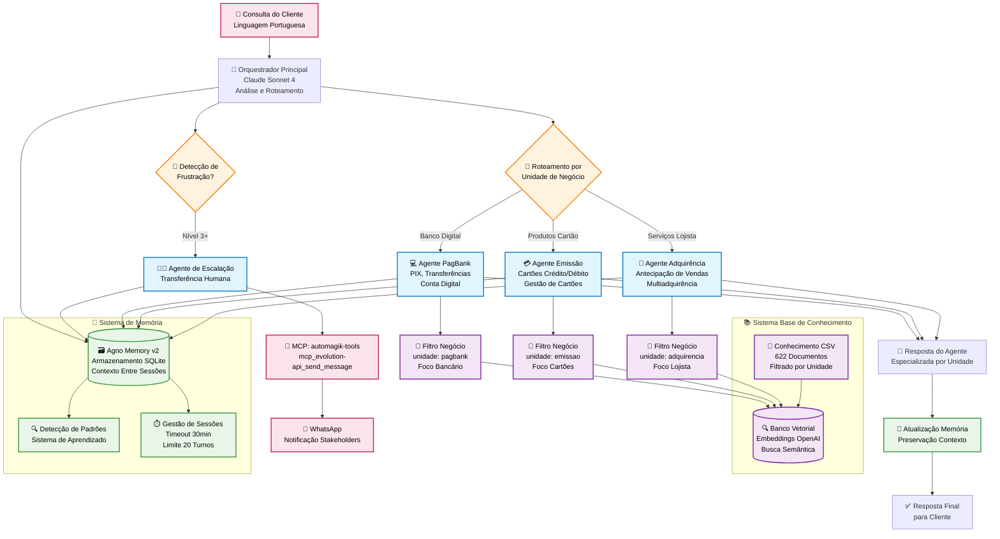

# Sistema Multi-Agente de Atendimento PagBank

Sistema sofisticado de atendimento ao cliente multi-agente construído com o framework Agno. O sistema roteia consultas de clientes para agentes especializados por unidade de negócio: Adquirência, Emissão, PagBank e Escalação Humana.

## 🏗️ Visão Geral da Arquitetura

O sistema utiliza uma arquitetura de orquestração inteligente onde o Orquestrador Principal roteia consultas de clientes para agentes especializados. Cada agente possui acesso dedicado à base de conhecimento com filtragem inteligente para respostas precisas e contextuais.



## 🚀 Início Rápido

### Configuração de Desenvolvimento

#### Configuração de Ambiente
```bash
# Copiar arquivo de exemplo
cp .env.example .env

# Editar .env com suas configurações
# PB_AGENTS_HOST=localhost  # Usar localhost para acesso local
# PB_AGENTS_PORT=8008       # Porta customizável
```

#### Opção 1: PostgreSQL (Recomendado)
```bash
# Iniciar PostgreSQL com Docker
docker run -d \
  -e POSTGRES_DB=ai \
  -e POSTGRES_USER=ai \
  -e POSTGRES_PASSWORD=ai \
  -p 5532:5432 \
  --name pgvector \
  agno/pgvector:16

# Instalar dependências
uv sync

# Iniciar sistema
uv run python api/playground.py  # Desenvolvimento
uv run python api/serve.py       # Produção
```

#### Opção 2: SQLite (Desenvolvimento Local)
```bash
# Instalar dependências
uv sync

# Iniciar sistema (SQLite será usado automaticamente)
uv run python api/playground.py  # Desenvolvimento
uv run python api/serve.py       # Produção
```

Endpoints disponíveis:
- Desenvolvimento: http://localhost:7777 (Playground com UI)
- Produção: http://localhost:8008 (API REST com docs em /docs) - configurável via PB_AGENTS_HOST e PB_AGENTS_PORT

## 🤖 Agentes por Unidade de Negócio

### Arquitetura dos Agentes
Cada agente de unidade de negócio opera independentemente com:

- **Claude Sonnet 4**: Raciocínio avançado com capacidade de thinking
- **Filtragem por Unidade**: Filtragem especializada da base de conhecimento
- **Integração de Memória**: Contexto persistente entre conversas
- **Expertise de Domínio**: Conhecimento profundo para cada unidade de negócio

### Unidades de Negócio

1. **🏪 Adquirência**: Antecipação de vendas, multiadquirência, soluções para lojistas, processamento de pagamentos
2. **💳 Emissão**: Cartões de crédito/débito, gestão de cartões, limites, benefícios, uso internacional
3. **💻 PagBank**: Transferências PIX, conta digital, folha de pagamento, recarga celular, segurança da conta
4. **👨‍💼 Escalação Humana**: Gestão de escalações, integração WhatsApp, roteamento de casos complexos

## 🎯 Filtragem Inteligente de Conhecimento

### Sistema de Filtros por Unidade de Negócio
O sistema automaticamente aplica filtros precisos baseados nas unidades de negócio:

```
Consulta: "Como solicitar antecipação de vendas?"
↓ Análise Automática ↓
Filtros Aplicados:
- business_unit: "adquirencia" (contexto do agente)
- typification: auto-detectado da consulta
↓ Resultado ↓
Documentos mais relevantes da unidade de negócio
```

### Estrutura da Base de Conhecimento
- **📄 622 Documentos**: Conhecimento abrangente dos serviços
- **🎯 4 Colunas Principais**: 
  - `problem`: Descrição do problema/consulta
  - `solution`: Solução detalhada
  - `typification`: Classificação do tipo de atendimento
  - `business_unit`: Unidade de negócio responsável
- **🔍 Embeddings OpenAI**: Busca semântica rápida
- **🔄 Hot Reload**: Atualizações do CSV sem parada do sistema

## 🧠 Gestão de Memória e Contexto

### Integração Agno Memory v2
- **Persistência Entre Sessões**: Contexto do cliente mantido entre conversas
- **Detecção de Padrões**: Sistema aprende com problemas e comportamentos recorrentes
- **Estado Compartilhado**: Transferências perfeitas entre agentes
- **Limites de Conversa**: Sessões de 30 minutos com máximo de 20 turnos

### Funcionalidades de Memória
- **Contexto do Usuário**: Interações anteriores e preferências
- **Rastreamento de Problemas**: Histórico de resolução de problemas
- **Sistema de Aprendizado**: Melhoria adaptativa através de padrões
- **Trilha de Auditoria**: Log completo de interações para compliance

## 📱 Escalação Humana & Integração WhatsApp

### Detecção de Frustração
- **Monitoramento Automático**: Rastreamento em tempo real do nível de frustração
- **Trigger Nível 3**: Escalação imediata para agente humano
- **Preservação de Contexto**: Histórico completo da conversa transferido

### Integração WhatsApp Evolution API
```
Frustração Detectada → Agente de Escalação → Evolution API
                                          ↓
                        Chamada HTTP direta para serviço WhatsApp
                        com contexto completo da conversa
```

## 🛠️ Stack Técnico

- **🤖 Framework IA**: Sistema Multi-Agente Agno
- **🧠 LLM**: Claude Sonnet 4 com capacidade de thinking
- **💾 Memória**: SQLite com Agno Memory v2
- **🔍 Vector Store**: Banco vetorial com indexação
- **📄 Embeddings**: OpenAI text-embedding-3-small
- **🔧 Linguagem**: Python 3.12+ com gerenciamento UV

## 📁 Estrutura do Projeto

```
pagbank-multiagents/
├── agents/                    # Sistema de agentes por unidade de negócio
│   ├── specialists/               # Agentes especializados por unidade
│   │   ├── base_agent.py         # Classe base dos agentes
│   │   ├── adquirencia_agent.py  # Agente de Adquirência
│   │   ├── emissao_agent.py      # Agente de Emissão
│   │   ├── pagbank_agent.py      # Agente PagBank
│   │   └── human_handoff_agent.py # Escalação humana
│   ├── prompts/                   # Prompts dos agentes
│   │   └── specialists/           # Prompts especializados por unidade
│   └── tools/                     # Ferramentas compartilhadas
├── orchestrator/              # Sistema de orquestração
│   ├── main_orchestrator.py       # Orquestrador principal
│   ├── clarification_handler.py   # Tratamento de esclarecimentos
│   ├── human_handoff_detector.py  # Detecção de frustração
│   ├── routing_logic.py           # Algoritmos de roteamento
│   └── state_synchronizer.py     # Gestão de estado
├── knowledge/                 # Sistema de base de conhecimento
│   ├── csv_knowledge_base.py      # Integração CSV
│   ├── enhanced_csv_reader.py     # Extração de metadados
│   ├── agentic_filters.py         # Filtragem inteligente
│   └── knowledge_rag.csv          # 622 documentos
├── memory/                    # Sistema de memória
│   ├── memory_manager.py          # Agno Memory v2
│   ├── pattern_detector.py        # Reconhecimento de padrões
│   └── session_manager.py         # Gestão de sessões
├── config/                    # Configuração do sistema
├── data/                      # Bancos de dados SQLite
├── tests/                     # Testes automatizados
│   ├── unit/                      # Testes unitários
│   ├── integration/               # Testes de integração
│   └── performance/               # Testes de performance
├── scripts/                   # Scripts utilitários
└── playground.py              # Ponto de entrada do sistema
```

## 🎯 Funcionalidades Principais

### Inteligência & Automação
- **🎯 Filtragem de Precisão**: Filtros por unidade de negócio entregam respostas mais relevantes
- **🧠 Consciência de Contexto**: Conversas alimentadas por memória com capacidades de aprendizado
- **⚡ Performance**: Tempos de resposta sub-2-segundos com roteamento inteligente
- **🔄 Escalabilidade**: Agentes independentes com infraestrutura de conhecimento compartilhada

### Integração Humana
- **👥 Escalação Perfeita**: Detecção automática de frustração com notificações WhatsApp
- **📱 Evolution API**: Integração HTTP direta com serviço WhatsApp
- **📊 Transferência de Contexto**: Histórico completo de conversa preservado durante transferências
- **🎫 Sistema de Tickets**: Gestão estruturada e rastreamento de casos

### Gestão de Conhecimento
- **📚 Busca Inteligente**: Consultas em linguagem natural automaticamente filtradas
- **🔄 Hot Reload**: Atualizações de conhecimento em tempo real sem reinicialização
- **🎯 Expertise de Domínio**: Especialização por unidade de negócio
- **📈 Sistema de Aprendizado**: Melhoria contínua através de detecção de padrões

## 🔐 Segurança & Compliance

- **🔒 Privacidade de Dados**: Proteção de informações do cliente com trilhas de auditoria abrangentes
- **🏛️ Compliance Bancário**: Aderência total às regulamentações financeiras
- **📊 Garantia de Qualidade**: Validação de respostas e monitoramento de precisão
- **🛡️ Detecção de Fraude**: Reconhecimento avançado de padrões para ameaças de segurança
- **🔑 Controle de Acesso**: Permissões baseadas em função e integração segura de API

## 📊 Performance do Sistema

### Otimização de Resposta
- **Roteamento Inteligente**: Distribuição de consultas consciente de contexto entre agentes especializados
- **Filtragem de Precisão**: Redução significativa no espaço de busca através de filtragem por unidade
- **Eficiência de Memória**: Gestão de contexto persistente sem redundância
- **Tempo de Resposta**: < 2 segundos em média com respostas altamente relevantes e contextuais

### Métricas de Escalabilidade
- **Independência de Agentes**: Especialização por unidade sem overhead de coordenação
- **Eficiência de Conhecimento**: Filtragem reduz overhead de processamento
- **Escalabilidade de Memória**: Armazenamento e recuperação eficientes entre sessões
- **Distribuição de Carga**: Roteamento automático balanceia carga do sistema efetivamente

---

**Desenvolvido pela Namastex Labs & Yaitech usando o Framework Agno**  
**© PagBank 2025**