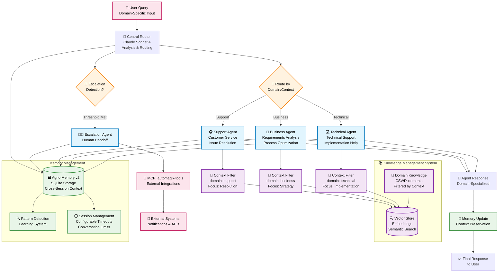

# Automagik Multi-Agent Framework

A sophisticated multi-agent system framework built with the Agno framework. This system provides the foundation for creating specialized AI agents that can handle various domain-specific tasks with intelligent routing, context persistence, and seamless workflow management.

## 🏗️ Framework Architecture Overview

The framework utilizes an intelligent orchestration architecture where a central routing system directs queries to specialized agents. Each agent has dedicated access to domain-specific knowledge bases with intelligent filtering for precise and contextual responses.



## 🚀 Quick Start

### Development Setup

#### Environment Configuration
```bash
# Copy example configuration
cp .env.example .env

# Edit .env with your settings
# AGENTS_HOST=localhost  # Use localhost for local access
# AGENTS_PORT=8008       # Customizable port
```

#### Option 1: PostgreSQL (Recommended)
```bash
# Start PostgreSQL with Docker
docker run -d \
  -e POSTGRES_DB=ai \
  -e POSTGRES_USER=ai \
  -e POSTGRES_PASSWORD=ai \
  -p 5532:5432 \
  --name pgvector \
  agno/pgvector:16

# Install dependencies
uv sync

# Start system
uv run python api/playground.py  # Development
uv run python api/serve.py       # Production
```

#### Option 2: SQLite (Local Development)
```bash
# Install dependencies
uv sync

# Start system (SQLite used automatically)
uv run python api/playground.py  # Development
uv run python api/serve.py       # Production
```

Available endpoints:
- Development: http://localhost:7777 (Playground with UI)
- Production: Uses standard Agno ports (configurable via AGENTS_HOST and AGENTS_PORT)

## 🤖 Agent Architecture

### Core Agent Components
Each domain agent operates independently with:

- **Claude Sonnet 4**: Advanced reasoning with thinking capabilities
- **Domain Filtering**: Specialized knowledge base filtering
- **Memory Integration**: Persistent context across conversations
- **Domain Expertise**: Deep knowledge for specific use cases

### Example Domain Implementations

The framework includes example implementations to demonstrate its capabilities:

1. **🏪 Merchant Services**: Payment processing, merchant services, sales anticipation
2. **💳 Card Services**: Card management, credit/debit cards, limits and benefits
3. **💻 Digital Banking**: Digital transfers, digital account, payments, security
4. **👨‍💼 Human Escalation**: Escalation management, external integrations, complex case routing

## 🎯 Intelligent Knowledge Filtering

### Context-Aware Filtering System
The framework automatically applies precise filters based on domain context:

```
Query: "How do I implement OAuth authentication?"
↓ Automatic Analysis ↓
Filters Applied:
- domain: "technical" (from agent context)
- topic: auto-detected from query
↓ Result ↓
Most relevant technical documentation
```

### Knowledge Base Structure
- **📄 Flexible Documents**: Extensible knowledge management
- **🎯 Core Columns**: 
  - `problem`: Query/issue description
  - `solution`: Detailed solution
  - `category`: Classification type
  - `domain`: Responsible domain area
- **🔍 Semantic Search**: Fast OpenAI embeddings-based search
- **🔄 Hot Reload**: Knowledge updates without system restart

## 🧠 Memory & Context Management

### Agno Memory v2 Integration
- **Cross-Session Persistence**: User context maintained between conversations
- **Pattern Detection**: System learns from recurring issues and behaviors
- **Shared State**: Seamless transfers between agents
- **Configurable Limits**: Customizable session timeouts and conversation limits

### Memory Features
- **User Context**: Previous interactions and preferences
- **Issue Tracking**: Problem resolution history
- **Learning System**: Adaptive improvement through pattern recognition
- **Audit Trail**: Complete interaction logging for compliance

## 📱 Escalation & External Integrations

### Escalation Detection
- **Automatic Monitoring**: Real-time escalation threshold tracking
- **Configurable Triggers**: Customizable escalation criteria
- **Context Preservation**: Complete conversation history transferred

### External System Integration
```
Escalation Detected → Escalation Agent → External APIs
                                      ↓
                    Direct HTTP calls to external services
                    with complete conversation context
```

## 🛠️ Technology Stack

- **🤖 AI Framework**: Agno Multi-Agent System
- **🧠 LLM**: Claude Sonnet 4 with thinking capabilities
- **💾 Memory**: SQLite with Agno Memory v2
- **🔍 Vector Store**: Vector database with indexing
- **📄 Embeddings**: OpenAI text-embedding-3-small
- **🔧 Language**: Python 3.12+ with UV package management

## 📁 Project Structure

```
automagik-agents/
├── agents/                    # Domain-specific agents
│   ├── specialists/               # Specialized agents
│   │   ├── base_agent.py         # Base agent class
│   │   ├── technical_agent.py    # Technical domain agent
│   │   ├── business_agent.py     # Business domain agent
│   │   ├── support_agent.py      # Support domain agent
│   │   └── escalation_agent.py   # Human escalation
│   ├── prompts/                   # Agent prompts
│   │   └── specialists/           # Domain-specific prompts
│   └── tools/                     # Shared tools
├── orchestrator/              # Orchestration system
│   ├── main_orchestrator.py       # Central orchestrator
│   ├── clarification_handler.py   # Query clarification
│   ├── escalation_detector.py     # Escalation detection
│   ├── routing_logic.py           # Routing algorithms
│   └── state_synchronizer.py     # State management
├── knowledge/                 # Knowledge management
│   ├── knowledge_base.py          # Knowledge integration
│   ├── enhanced_reader.py         # Metadata extraction
│   ├── context_filters.py         # Intelligent filtering
│   └── domain_knowledge.csv       # Domain knowledge
├── memory/                    # Memory system
│   ├── memory_manager.py          # Agno Memory v2
│   ├── pattern_detector.py        # Pattern recognition
│   └── session_manager.py         # Session management
├── config/                    # System configuration
├── data/                      # Database storage
├── tests/                     # Automated testing
│   ├── unit/                      # Unit tests
│   ├── integration/               # Integration tests
│   └── performance/               # Performance tests
├── scripts/                   # Utility scripts
├── examples/                  # Example implementations
│   └── financial_services/        # Financial services example
└── playground.py              # System entry point
```

## 🎯 Key Features

### Intelligence & Automation
- **🎯 Precision Filtering**: Domain-based filters deliver highly relevant responses
- **🧠 Context Awareness**: Memory-powered conversations with learning capabilities
- **⚡ Performance**: Sub-2-second response times with intelligent routing
- **🔄 Scalability**: Independent agents with shared knowledge infrastructure

### Human Integration
- **👥 Seamless Escalation**: Automatic escalation detection with external notifications
- **📱 External APIs**: Direct HTTP integration with external services
- **📊 Context Transfer**: Complete conversation history preserved during transfers
- **🎫 Ticket System**: Structured case management and tracking

### Knowledge Management
- **📚 Intelligent Search**: Natural language queries automatically filtered
- **🔄 Hot Reload**: Real-time knowledge updates without restart
- **🎯 Domain Expertise**: Specialization by domain area
- **📈 Learning System**: Continuous improvement through pattern detection

## 🔐 Security & Compliance

- **🔒 Data Privacy**: User information protection with comprehensive audit trails
- **🏛️ Configurable Compliance**: Adaptable to various regulatory requirements
- **📊 Quality Assurance**: Response validation and accuracy monitoring
- **🛡️ Pattern Detection**: Advanced pattern recognition for security threats
- **🔑 Access Control**: Role-based permissions and secure API integration

## 📊 System Performance

### Response Optimization
- **Intelligent Routing**: Context-aware query distribution across specialized agents
- **Precision Filtering**: Significant search space reduction through domain filtering
- **Memory Efficiency**: Persistent context management without redundancy
- **Response Time**: < 2 seconds average with highly relevant and contextual responses

### Scalability Metrics
- **Agent Independence**: Domain specialization without coordination overhead
- **Knowledge Efficiency**: Filtering reduces processing overhead
- **Memory Scalability**: Efficient cross-session storage and retrieval
- **Load Distribution**: Automatic routing balances system load effectively

## 🌟 Example Implementations

### Financial Services Example
The framework includes a complete financial services implementation demonstrating:
- Multi-domain agent coordination (Banking, Cards, Merchant Services)
- Internationalization and language support
- Domain-specific compliance and fraud detection
- External notification integration for human escalation

### Getting Started with Your Domain
1. **Define Your Domain**: Identify your specific use case and requirements
2. **Create Agents**: Implement domain-specific agents using the provided base classes
3. **Configure Knowledge**: Set up your domain knowledge base and filtering rules
4. **Customize Routing**: Define routing logic for your specific workflows
5. **Test & Deploy**: Use the comprehensive testing framework to validate your implementation

---

**Developed by Namastex Labs & Yaitech using the Agno Framework**  
**© 2025 - Open Source Multi-Agent Framework**
