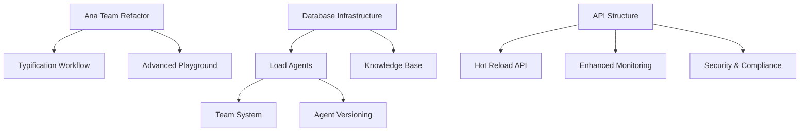

# PagBank Agents V2 - Project Status Central

**Last Updated**: 2025-01-12
**Branch**: v2 (clean rewrite, no backwards compatibility)
**Status**: PLANNING COMPLETE - READY FOR PARALLEL EXECUTION

## 🎯 Project Overview
Complete V2 rewrite of PagBank multi-agent system using Agno framework patterns.
- Transform POC into production-ready "agent factory" platform
- Support ALL PagBank business units through YAML configuration
- Implement Team mode=config["team"]["mode"] pattern from agno-demo-app
- Database-driven configuration with hot reload
- 5-level hierarchical typification workflow

## 📊 Overall Progress

### Phase 1: Foundation
- [ ] **Ana Team Refactor** → Agent 1
  - [ ] Extract routing logic from orchestrator
  - [ ] Implement Team mode=config["team"]["mode"] pattern
  - [ ] Create specialist definitions
  - [ ] Test routing accuracy
  - **File**: `task-cards/phase1/01-refactor-ana-team.md`
  - **Blocks**: None

- [ ] **Database Infrastructure** → Agent 2
  - [ ] Setup PostgreSQL with PgVector
  - [ ] Create Alembic migrations
  - [ ] Implement config loader
  - [ ] Test YAML to DB flow
  - **File**: `task-cards/phase1/02-database-infrastructure.md`
  - **Blocks**: None

- [ ] **API Structure** → Agent 3
  - [ ] Create FastAPI app structure
  - [ ] Implement lifespan management
  - [ ] Add unified playground endpoint
  - [ ] Setup streaming responses
  - **File**: `task-cards/phase1/03-api-structure.md`
  - **Blocks**: None

- [ ] **Load Agents to DB** → Any Agent
  - [ ] Wait for database infrastructure
  - [ ] Load all agent YAMLs
  - [ ] Verify database entries
  - [ ] Test agent retrieval
  - **File**: `task-cards/phase1/04-load-agents.md`
  - **Blocks**: Database Infrastructure must be complete

### Phase 2: Platform Core
- [ ] **Team System** → Agent 1
  - [ ] Implement team YAML structure
  - [ ] Create team loader
  - [ ] Add team endpoints
  - [ ] Test team composition
  - **File**: `task-cards/phase2/01-team-system.md`
  - **Blocks**: Load Agents complete

- [ ] **Typification Workflow** → Agent 4
  - [ ] Parse CSV hierarchy (5 levels)
  - [ ] Create sequential workflow
  - [ ] Integrate with Ana team
  - [ ] Test categorization accuracy
  - **File**: `task-cards/phase2/02-typification-workflow.md`
  - **Blocks**: Ana Team Refactor complete

- [ ] **Knowledge Base** → Agent 2
  - [ ] Setup pgvector tables
  - [ ] Implement CSV loader
  - [ ] Create retrieval endpoints
  - [ ] Test knowledge queries
  - **File**: `task-cards/phase2/03-knowledge-base.md`
  - **Blocks**: Database Infrastructure complete

- [ ] **Agent Versioning** → Agent 3
  - [ ] Design version schema
  - [ ] Implement version endpoints
  - [ ] Add A/B testing support
  - [ ] Test version switching
  - **File**: `task-cards/phase2/04-agent-versioning.md`
  - **Blocks**: Load Agents complete

- [ ] **Hot Reload API** → Agent 5
  - [ ] Implement file watcher
  - [ ] Create reload mechanism
  - [ ] Add validation checks
  - [ ] Test live updates
  - **File**: `task-cards/phase2/05-hot-reload-api.md`
  - **Blocks**: API Structure complete

### Phase 3: Production Features
- [ ] **Enhanced Monitoring** → Agent 2
  - [ ] Setup metrics collection
  - [ ] Create dashboards
  - [ ] Add alerts
  - [ ] Test monitoring flow
  - **File**: `task-cards/phase3/01-enhanced-monitoring.md`
  - **Blocks**: API Structure complete

- [ ] **Advanced Playground** → Agent 1
  - [ ] Enhance UI features
  - [ ] Add debug mode
  - [ ] Implement comparisons
  - [ ] Test user experience
  - **File**: `task-cards/phase3/02-advanced-playground.md`
  - **Blocks**: Ana Team Refactor complete

- [ ] **Security & Compliance** → Agent 6
  - [ ] Implement auth system
  - [ ] Add rate limiting
  - [ ] Setup audit logging
  - [ ] Test security measures
  - **File**: `task-cards/phase3/03-security-compliance.md`
  - **Blocks**: API Structure complete

## 🔄 Dependency Graph



## 📁 Document Structure

```
genie/
├── active/
│   ├── project-status.md          # THIS FILE - Central status
│   └── agent-coordination.md      # Multi-agent rules
├── completed/
│   └── 2025-01-12-platform-strategy.md
├── reference/
│   ├── agno-patterns.md          # Agno framework patterns
│   ├── agno-parameter-patterns.md # Complete parameter reference
│   ├── database-schema.md        # V2 database design
│   ├── yaml-configuration.md     # YAML-first approach
│   └── context-search-tools.md  # MCP tools for Agno docs
└── task-cards/
    ├── 00-task-overview.md       # Execution plan
    ├── phase1/                   # Foundation tasks
    ├── phase2/                   # Core platform
    └── phase3/                   # Production features
```

## 🤝 Agent Coordination Protocol

1. **Check Status**: Always read this file first
2. **Claim Task**: Update checkbox to "in progress"
3. **Check Dependencies**: Verify blocking tasks are complete
4. **Wait if Blocked**: Use `mcp__wait__wait_minutes` tool
5. **Update Progress**: Mark subtasks as complete
6. **Complete Task**: Update main checkbox when done

## 🛠️ Available Tools for Agno Questions

- `mcp__search-repo-docs__resolve-library-id`: Find Agno library ID
- `mcp__search-repo-docs__get-library-docs`: Get Agno documentation
- `mcp__ask-repo-agent__ask_question`: Ask specific Agno questions

## ⚠️ Critical Rules

1. **NEVER** work on a task if dependencies aren't complete
2. **ALWAYS** update this status file when starting/completing tasks
3. **USE** wait tool (30+ minutes) when blocked by dependencies
4. **CHECK** status after each wait period
5. **REFERENCE** task cards for detailed implementation
6. **CONSULT** reference documents for patterns and examples

## 🚀 Starting Development

```bash
# Agent checks status
cat genie/active/project-status.md

# If blocked by dependencies
mcp__wait__wait_minutes(duration=30)

# After wait, check again
cat genie/active/project-status.md

# When clear, proceed with task
cat genie/task-cards/phase1/01-refactor-ana-team.md
```

## 📝 Notes

- All agents work in parallel where possible
- Use same branch (v2) for all work
- Commit with co-author: `Co-Authored-By: Automagik Genie <genie@namastex.ai>`
- Test continuously to avoid breaking existing functionality
- Document patterns discovered during implementation