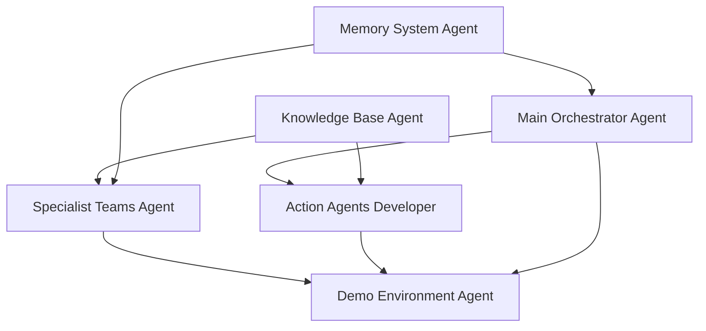

# PagBank Multi-Agent System Development Plan

## Project Timeline
- Total Duration: 10-12 days
- Critical Path: Memory System → Main Orchestrator → Knowledge Base → Specialist Teams → Demo Environment

## Project Overview
Develop a POC multi-agent customer support system for PagBank demonstrating AI-powered customer service with intelligent routing, contextual memory, fraud detection, and adaptive language capabilities using Claude-Sonnet-4 (claude-sonnet-4-20250514).

## Project Structure
All development will be done in the `pagbank/` directory, with the following organization:
- `pagbank/agents/` - Action agents implementations
- `pagbank/teams/` - Specialist team implementations
- `pagbank/orchestrator/` - Main routing system
- `pagbank/knowledge/` - Knowledge base and CSV data
- `pagbank/memory/` - Memory system and database
- `pagbank/demo/` - Demo environment and scenarios
- `pagbank/utils/` - Shared utilities and tools
- `pagbank/config/` - Configuration files

## Dependencies Graph

## Task Breakdown

### 1. Memory System Implementation - Assigned to: Memory System Agent - Duration: 2 days
**Dependencies:** None (Foundation layer)
**Deliverables:**
- SqliteMemoryDb configuration with persistence
- Memory object with agentic memory enabled
- User memory tracking system
- Pattern detection algorithms
- Session state management

**Success Criteria:**
- Memory persists across sessions
- Pattern detection identifies recurring issues
- Session state properly shared across agents
- Memory queries return relevant historical context

### 2. Knowledge Base Setup - Assigned to: Knowledge Base Agent - Duration: 2 days
**Dependencies:** None (Can run parallel with Memory System)
**Deliverables:**
- CSV conversion from raw knowledge data
- CSVKnowledgeBase with PgVector integration
- Metadata structure implementation
- Agentic filters configuration
- Search validation tests

**Success Criteria:**
- Knowledge base returns accurate results with <2s latency
- Filters properly segment knowledge by team
- Metadata enables contextual search
- All 5 specialist areas properly indexed

### 3. Main Orchestrator Development - Assigned to: Main Orchestrator Agent - Duration: 2 days
**Dependencies:** Memory System
**Deliverables:**
- Main routing Team with mode="route"
- Integrated clarification logic
- Frustration detection system
- Message normalization function
- team_session_state implementation

**Success Criteria:**
- 95%+ routing accuracy
- Frustration detected within 3 interactions
- Clarification reduces ambiguity by 80%
- Session state properly maintained

### 4. Specialist Teams Implementation - Assigned to: Specialist Teams Agent - Duration: 3 days
**Dependencies:** Knowledge Base, Memory System
**Deliverables:**
- 5 specialized teams (Cards, Digital Account, Investments, Credit, Insurance)
- Knowledge filter configurations
- Language adaptation prompts
- Compliance warnings (Investments)
- Fraud detection (Credit)

**Success Criteria:**
- Each team responds accurately to domain queries
- Knowledge filters return relevant results
- Language adapts to customer profile
- Compliance/fraud detection triggers appropriately

### 5. Action Agents Development - Assigned to: Action Agents Developer - Duration: 2 days
**Dependencies:** Main Orchestrator, Knowledge Base
**Deliverables:**
- Technical Escalation Agent
- Feedback Collector Agent
- Human Agent (mock)
- Support tools (ticket creation, text normalization)
- Memory integration for patterns

**Success Criteria:**
- Tickets created with proper context
- Feedback categorized correctly
- Human transfer simulated realistically
- Pattern learning improves over time

### 6. Demo Environment Setup - Assigned to: Demo Environment Agent - Duration: 1 day
**Dependencies:** All other components
**Deliverables:**
- Demo scripts for 6 cases
- Simple routing dashboard
- Logging system
- Reset functionality
- Customer profile samples

**Success Criteria:**
- All 6 demo cases run without errors
- Dashboard visualizes routing flow
- System resets cleanly between demos
- Logs capture key interactions

## Risk Mitigation

### Technical Risks
1. **PgVector Performance Issues**
   - Mitigation: Pre-index knowledge base, optimize embedding dimensions
   - Fallback: Use ChromaDB if PgVector has issues

2. **Memory System Conflicts**
   - Mitigation: Clear schema definition, transaction management
   - Fallback: In-memory storage for demo if persistence fails

3. **Complex Routing Logic**
   - Mitigation: Start with simple keyword matching, then enhance
   - Fallback: Manual routing override for demo

### Integration Risks
1. **Claude API Rate Limits**
   - Mitigation: Implement retry logic, request batching
   - Fallback: Cache common responses

2. **Session State Synchronization**
   - Mitigation: Clear state management protocols
   - Fallback: Centralized state manager

## Integration Points

### Critical Integration Interfaces

1. **Memory ↔ Orchestrator**
   - Session state structure must match exactly
   - Memory queries need standardized format
   - Pattern detection results feed routing logic

2. **Knowledge Base ↔ Specialist Teams**
   - Filter configurations must align with metadata
   - Search queries need consistent format
   - Results parsing must be standardized

3. **Orchestrator ↔ Action Agents**
   - Escalation triggers clearly defined
   - Context passing protocol established
   - Return handling for continued conversation

4. **All Components → Demo Environment**
   - Logging format standardized
   - Reset protocols defined
   - Dashboard data structure agreed

## Implementation Phases

### Phase 1: Foundation (Days 1-2)
- Memory System setup
- Knowledge Base creation
- Basic infrastructure

### Phase 2: Core System (Days 3-4)
- Main Orchestrator implementation
- Basic routing functionality
- Initial integration tests

### Phase 3: Specialists (Days 5-7)
- All 5 specialist teams
- Knowledge integration
- Language adaptation

### Phase 4: Actions & Polish (Days 8-9)
- Action agents implementation
- System integration
- Bug fixes and optimization

### Phase 5: Demo Ready (Days 10-12)
- Demo environment setup
- All test cases validated
- Performance optimization
- Documentation finalized

## Key Technical Decisions

1. **Model Configuration**
   - All agents use Claude-Sonnet-4 (claude-sonnet-4-20250514)
   - Temperature: 0.1 for consistency
   - Max tokens: 2048
   - Markdown output enabled for demo

2. **Database Architecture**
   - SQLite for memory persistence (simple, sufficient for POC)
   - PgVector for knowledge base (semantic search capability)
   - Flat file for demo reset capability

3. **Agent Communication**
   - team_session_state for shared context
   - Structured message passing between agents
   - Event-driven updates for dashboard

4. **Error Handling**
   - Graceful degradation if components fail
   - Clear error messages for demo
   - Fallback responses for each agent

## Success Metrics

1. **Functional Requirements**
   - All 6 demo cases execute successfully
   - <2 second response time for queries
   - Zero critical errors during 30-minute demo

2. **Quality Metrics**
   - 95%+ routing accuracy
   - 90%+ knowledge retrieval relevance
   - 100% fraud detection for test cases

3. **User Experience**
   - Natural conversation flow
   - Appropriate language adaptation
   - Smooth escalation process

## Resource Requirements

1. **Development Environment**
   - Agno framework latest version
   - Claude-Sonnet-4 API access (claude-sonnet-4-20250514)
   - PostgreSQL with PgVector extension
   - Python 3.10+ environment
   - Project working directory: `pagbank/`

2. **Testing Resources**
   - Sample customer data
   - Test knowledge base entries
   - Demo script validators

## Final Deliverable Checklist

- [ ] Working multi-agent system with all teams
- [ ] Populated knowledge base (500+ entries)
- [ ] 6 demo scenarios fully scripted
- [ ] Simple dashboard showing routing
- [ ] Setup and demo documentation
- [ ] Performance metrics report
- [ ] Source code with comments
- [ ] Deployment instructions
- [ ] Main entry point: `pagbank/main.py`
- [ ] Playground launcher: `pagbank/playground_app.py`

## Next Steps

1. Create individual todo_[agent].md files with detailed specifications
2. Set up development environment
3. Begin parallel development of Memory System and Knowledge Base
4. Daily progress sync between sub-agents
5. Integration testing at each phase completion