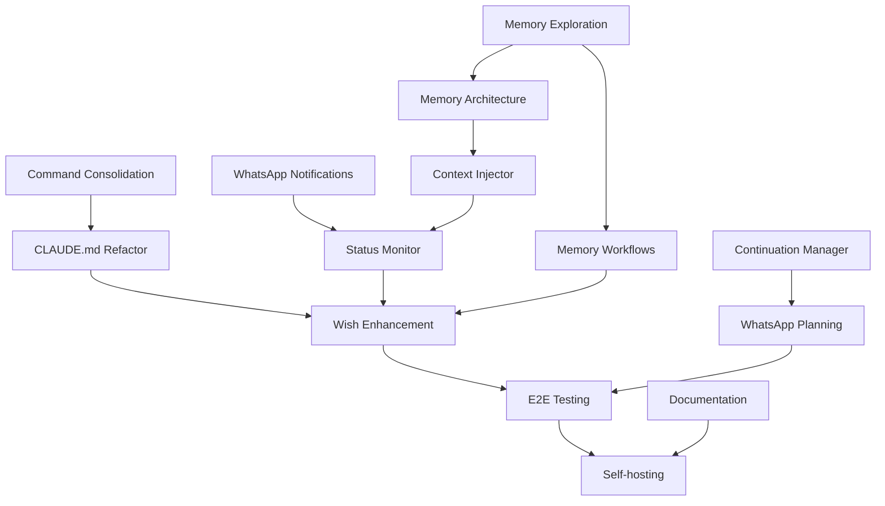

# Epic: Genie Framework Completion

## Epic ID: genie-framework-completion
## Type: Framework Development
## Priority: Critical

## Overview

Transform Automagik into **Genie-Agents** - the first complete implementation of the semi-autonomous Genie Framework. This epic will establish a new paradigm for AI-assisted development with human-guided planning, fully automated execution, and revolutionary memory-based context management.

## Vision

> Semi-autonomous development where humans collaborate during planning, then step back as AI orchestrates fully automated execution enhanced by Zen's multi-model capabilities and mem0-based persistent memory.

## Success Criteria

1. **Context Automation**: 100% automatic context injection via hooks
2. **Command Simplification**: ≤15 primary commands (no backwards compatibility)
3. **CLAUDE.md Optimization**: Reduced from current size to <700 lines
4. **Memory Integration**: Replace CONTEXT.md files with genie-memory
5. **WhatsApp Notifications**: User notified for long-running tasks
6. **Self-Hosting**: Framework can enhance itself

## Task Breakdown

### Phase 1: Foundation & Memory Exploration

#### [P] T-001: Explore genie-memory capabilities
**Description**: Test mem0-based memory system for inter-agent communication and context persistence
**Acceptance Criteria**:
- Test memory storage/retrieval across agents
- Explore metadata capabilities
- Design memory architecture for replacing CONTEXT.md
- Document usage patterns and limitations

#### [P] T-002: Design memory-based context system
**Description**: Architecture for replacing file-based context with dynamic memory
**Acceptance Criteria**:
- Memory schema for project context
- Agent communication patterns
- Persistent storage strategy
- Migration plan from CONTEXT.md

#### [W:T-001] T-003: Implement task-context-injector.sh
**Description**: Core hook for automatic context injection using memory
**Acceptance Criteria**:
- Intercept all Task() calls
- Inject context from genie-memory
- Fallback to CLAUDE.md if memory empty
- Test with sample agents

### Phase 2: Command Consolidation & Simplification

#### [P] T-004: Audit and consolidate commands
**Description**: Reduce from 45+ to ≤15 primary commands
**Acceptance Criteria**:
- Remove all model-specific subcommands
- Implement unified model parameter
- Hide specialized commands
- Create command help system
**Commands to Keep**:
```
Core: /wish, /planner, /epic, /spawn-tasks, /context
Development: /review, /debug, /analyze, /refactor, /test
Documentation: /docs, /handoff
Utility: 3-4 essential utilities
```

#### [W:T-004] T-005: CLAUDE.md interactive refactoring
**Description**: Collaborate with user to slim down CLAUDE.md to <700 lines
**Acceptance Criteria**:
- Review each section with user
- Move verbose content to ai-context/
- Keep only workflow-critical information
- Follow 3-tier documentation model
- Apply template structure
**Interactive Points**:
- Multi-agent coordination rules
- Development configuration
- Post-task protocols
- Genie framework notes

### Phase 3: Notification & Automation

#### [P] T-006: Implement WhatsApp notifications
**Description**: Replace audio notifications with WhatsApp messages
**Acceptance Criteria**:
- Hook for task completion
- Long-running task alerts
- Error notifications
- Configurable message templates
**Implementation**:
```python
mcp__send_whatsapp_message__send_text_message(
    instance="SofIA",
    message=f"🤖 Task completed: {task_name}\n✅ Status: {status}"
)
```

#### [W:T-003] T-007: Create status-monitor.sh
**Description**: Monitor epic progress and trigger notifications
**Acceptance Criteria**:
- Watch epic-status.md changes
- Auto-trigger dependent tasks
- Send WhatsApp updates
- Memory-based progress tracking

### Phase 4: Advanced Memory Integration

#### [W:T-005] T-008: Implement memory-based workflows
**Description**: Advanced memory usage patterns
**Memory Use Cases**:
1. **Inter-agent communication**: Agents share discoveries via memory
2. **Planning context**: Store planning decisions and rationale
3. **Error patterns**: Remember common issues and solutions
4. **Performance metrics**: Track execution times and optimize
5. **User preferences**: Learn and adapt to user style
**Acceptance Criteria**:
- Implement 3+ advanced memory patterns
- Create memory query interface
- Design retention policies
- Performance optimization

#### [P] T-009: Create continuation-manager.sh
**Description**: Hybrid memory + Zen continuation system
**Acceptance Criteria**:
- Store continuation IDs in memory
- Link memory threads to Zen contexts
- Implement checkpoint/restore
- Handle 3-hour expiry gracefully

### Phase 5: Planning Enhancement

#### [W:T-007,T-008] T-010: Enhance /wish with memory
**Description**: Smart routing using historical patterns
**Acceptance Criteria**:
- Learn from past wishes
- Suggest similar solutions
- Progressive complexity detection
- Memory-based templates

#### [P] T-011: Integrate WhatsApp in planning
**Description**: Interactive planning via WhatsApp
**Acceptance Criteria**:
- Send planning questions to user
- Receive responses asynchronously
- Continue planning when user responds
- Timeout handling

### Phase 6: Integration & Polish

#### [W:T-010,T-011] T-012: End-to-end testing
**Description**: Complete workflow validation
**Test Scenarios**:
1. Memory-based context flow
2. WhatsApp notification pipeline
3. Command consolidation
4. Planning to execution
5. Self-enhancement capability

#### [P] T-013: Create reference documentation
**Description**: Document the complete Genie Framework
**Deliverables**:
- Architecture overview
- Memory patterns guide
- Command reference (<15 commands)
- Hook implementation guide
- Best practices

#### [W:T-012,T-013] T-014: Self-hosting validation
**Description**: Use Genie to enhance Genie
**Acceptance Criteria**:
- Create enhancement epic using framework
- Execute with full automation
- Document meta-development
- Prove self-improvement

## Dependency Graph



## Technical Architecture

### Memory Schema Design
```python
# Project context in memory
{
    "project_id": "genie-agents",
    "context": {
        "vision": "Semi-autonomous AI development",
        "phase": "framework-completion",
        "architecture": "Multi-agent with Zen enhancement"
    },
    "agents": {
        "agent_id": {
            "current_task": "T-001",
            "discoveries": [...],
            "last_active": "timestamp"
        }
    },
    "workflows": {
        "active_epics": [...],
        "command_history": [...],
        "user_preferences": {...}
    }
}
```

### Hook Integration Points
1. **task-context-injector.sh**: Memory-based context injection
2. **whatsapp-notifier.sh**: Task completion alerts
3. **memory-sync.sh**: Cross-agent memory synchronization
4. **status-monitor.sh**: Progress tracking and notifications

### Command Consolidation Map
```
OLD                          NEW
/o3/thinkdeep       →       /thinkdeep model="o3"
/grok/analyze       →       /analyze model="grok"
/zen-consensus      →       /consensus models=[...]
[30+ variants]      →       [≤15 unified commands]
```

## Risk Mitigation

1. **Memory System Failure**
   - Fallback to file-based context
   - Regular memory backups
   - Graceful degradation

2. **WhatsApp API Limits**
   - Rate limiting implementation
   - Message batching
   - Fallback to logs

3. **Command Migration Confusion**
   - Clear help system
   - Command discovery tool
   - Migration guide

## Revolutionary Features

### 1. Memory-Based Context Management
- No more CONTEXT.md files
- Dynamic, learning context
- Cross-agent knowledge sharing
- Persistent across sessions

### 2. WhatsApp Integration
- Real-time user interaction
- Async planning dialogue
- Progress notifications
- Error alerts

### 3. Self-Improving System
- Learn from execution patterns
- Optimize based on metrics
- Adapt to user preferences
- Evolve command usage

## Next Steps

1. **Review and approve this epic**
2. **Begin with memory exploration (T-001)**
3. **Set up WhatsApp testing environment**
4. **Schedule CLAUDE.md refactoring session (T-005)**

---

**Note**: This epic represents the birth of truly semi-autonomous AI development. The combination of memory-based context, WhatsApp notifications, and radical simplification will create a framework that's both powerful and intuitive.