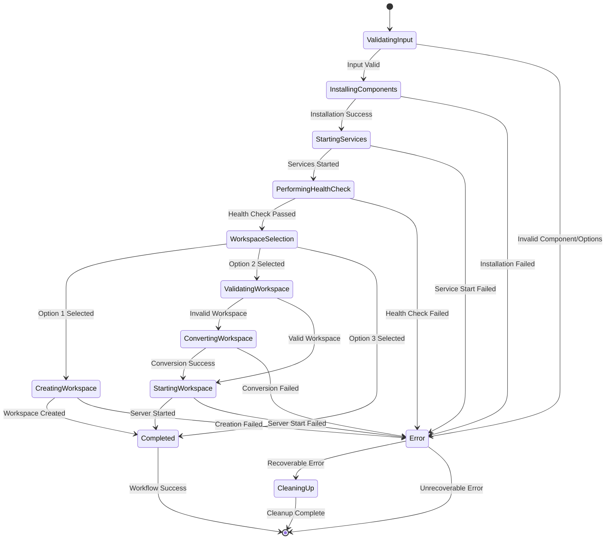

# Technical Specification Document: Phase 2 Workflow Integration

## 1. OVERVIEW
**Objective**: Implement unified `install → start → health → workspace` workflow for Automagik Hive deployment system with seamless user experience and intelligent automation.

**Success Metrics**:
- One-command deployment from zero to running workspace
- Interactive workspace selection with three options (new/existing/skip)
- Component-specific health validation with detailed diagnostics
- Auto-dependency detection and installation prompting
- 95% automation with minimal user interaction required

## 2. FUNCTIONAL REQUIREMENTS

### 2.1 Core Workflow Features

#### Unified Installation Command
- **Requirement**: `uvx automagik-hive --install [component]` executes full workflow automatically
- **Components**: `all` (default), `workspace`, `agent`, `genie`
- **Behavior**: Install → Start → Health → Workspace (with component-specific variations)
- **Acceptance Criteria**: 
  - Single command deploys complete system from scratch
  - Component-specific installs skip irrelevant steps
  - Agent/genie installs avoid interactive prompts for automation

#### Interactive Workspace Selection
- **Requirement**: Three-option workspace selection after health checks pass
- **Options**:
  1. **Initialize new workspace**: Create new project with prompt for name
  2. **Select existing workspace**: Browse and validate existing workspace
  3. **Skip workspace setup**: Continue without workspace (setup later)
- **Acceptance Criteria**:
  - Clear visual prompts with numbered options
  - Input validation and error handling
  - Graceful fallback for invalid selections

#### Health Checking System
- **Requirement**: Component-specific health validation with detailed diagnostics
- **Components**: Database connectivity, API endpoints, workspace processes, interdependencies
- **Acceptance Criteria**:
  - Database connection tests with proper error reporting
  - API endpoint availability with response validation
  - Resource usage monitoring with thresholds
  - Service interdependency validation

### 2.2 User Stories

#### Story 1: New User First-Time Setup
```
As a new user,
I want to run one command and get a fully working workspace,
So that I can start development immediately without complex setup.

Acceptance:
- Run `uvx automagik-hive --install`
- System installs all components automatically
- Health checks verify everything is working
- Interactive prompt guides workspace creation
- End result: Ready-to-use development environment
```

#### Story 2: Developer Workspace Management
```
As a developer,
I want to start existing workspaces with dependency auto-detection,
So that I can quickly resume work on different projects.

Acceptance:
- Run `uvx automagik-hive ./my-project`
- System detects missing dependencies (agent, genie, database)
- Prompts to install missing components
- Starts workspace server with full integration
```

#### Story 3: Component-Specific Development
```
As a system administrator,
I want to install and manage specific components independently,
So that I can optimize resources and deployment patterns.

Acceptance:
- `uvx automagik-hive --install agent` starts only agent services
- `uvx automagik-hive --install workspace` starts only workspace locally
- No interactive prompts for agent/genie installations (automation-friendly)
- Full component isolation with proper health checks
```

## 3. NON-FUNCTIONAL REQUIREMENTS

### 3.1 Performance
- **Installation Time**: Complete `--install all` workflow in under 2 minutes on standard hardware
- **Health Check Speed**: All component health checks complete within 30 seconds
- **Workspace Creation**: New workspace initialization completes in under 10 seconds
- **Memory Usage**: Installation process uses maximum 512MB RAM during operation

### 3.2 Reliability
- **Error Recovery**: Graceful rollback on any step failure with clear error messages
- **State Persistence**: Installation progress tracked with resume capability
- **Health Monitoring**: Continuous health validation during startup process
- **Timeout Handling**: Configurable timeouts for all network operations (default: 60s)

### 3.3 Usability
- **User Experience**: Clear progress indicators with estimated completion times
- **Error Messages**: Actionable error messages with suggested fixes
- **Interactive Prompts**: Intuitive interface with validation and help text
- **Documentation**: Comprehensive inline help and examples

### 3.4 Security
- **Credential Management**: Secure generation and storage of authentication credentials
- **Network Security**: HTTPS verification for external dependencies
- **File Permissions**: Proper file and directory permissions for all created assets
- **Container Security**: Minimal container privileges with security best practices

## 4. TECHNICAL ARCHITECTURE

### 4.1 System Components

#### UnifiedInstaller Class
```python
class UnifiedInstaller:
    """Orchestrates the complete install → start → health → workspace workflow."""
    
    def __init__(self):
        self.service_manager = ServiceManager()
        self.health_checker = HealthChecker()
        self.workspace_manager = WorkspaceManager()
        self.progress_tracker = ProgressTracker()
    
    def install_with_workflow(self, component: str = "all") -> WorkflowResult:
        """Execute complete workflow with progress tracking and error recovery."""
    
    def health_check(self, component: str = "all") -> HealthReport:
        """Comprehensive health validation with detailed diagnostics."""
    
    def interactive_workspace_setup(self, component: str = "all") -> WorkspaceResult:
        """Interactive workspace selection with validation."""
```

#### WorkspaceManager Class
```python
class WorkspaceManager:
    """Handles all workspace operations including creation, validation, and conversion."""
    
    def prompt_workspace_choice(self) -> WorkspaceChoice:
        """Interactive three-option workspace selection."""
        
    def initialize_workspace(self, name: str | None = None) -> WorkspaceResult:
        """Create new workspace with optional name prompt."""
        
    def validate_existing_workspace(self, path: str) -> ValidationResult:
        """Validate existing folder as workspace with detailed reporting."""
        
    def initialize_existing_folder(self, path: str) -> ConversionResult:
        """Convert existing folder to valid workspace."""
        
    def start_workspace_server(self, workspace_path: str) -> ServerResult:
        """Start server with auto-dependency detection."""
    
    def detect_missing_dependencies(self, workspace_path: str) -> DependencyReport:
        """Analyze workspace for missing components."""
```

#### HealthChecker Class
```python
class HealthChecker:
    """Component-specific health validation with detailed diagnostics."""
    
    def check_database_connectivity(self, component: str) -> DatabaseHealth:
        """Test database connections with connection pooling validation."""
        
    def check_api_endpoints(self, component: str) -> ApiHealth:
        """Validate API endpoint availability and response times."""
        
    def check_resource_usage(self, component: str) -> ResourceHealth:
        """Monitor CPU, memory, and disk usage with thresholds."""
        
    def check_service_interdependencies(self, component: str) -> DependencyHealth:
        """Validate service communication and dependency resolution."""
        
    def generate_health_report(self, component: str) -> HealthReport:
        """Comprehensive health report with actionable recommendations."""
```

### 4.2 Data Models

#### Workflow State Management
```python
@dataclass
class WorkflowState:
    component: str
    current_step: str
    completed_steps: list[str]
    failed_steps: list[str]
    start_time: datetime
    estimated_completion: datetime
    
@dataclass
class WorkflowResult:
    success: bool
    component: str
    duration: timedelta
    steps_completed: list[str]
    errors: list[WorkflowError]
    workspace_created: bool
    next_actions: list[str]
```

#### Health Monitoring Models
```python
@dataclass
class HealthReport:
    component: str
    overall_health: HealthStatus
    database_health: DatabaseHealth
    api_health: ApiHealth
    resource_health: ResourceHealth
    dependency_health: DependencyHealth
    recommendations: list[str]
    
@dataclass
class DatabaseHealth:
    status: HealthStatus
    connection_time: float
    pool_size: int
    active_connections: int
    error_details: str | None
    
@dataclass
class ApiHealth:
    status: HealthStatus
    response_time: float
    endpoint_url: str
    status_code: int
    error_details: str | None
```

#### Workspace Management Models
```python
@dataclass
class WorkspaceChoice:
    action: str  # "new", "existing", "skip"
    path: str
    name: str | None
    
@dataclass
class ValidationResult:
    is_valid: bool
    missing_files: list[str]
    invalid_config: list[str]
    suggestions: list[str]
    
@dataclass
class DependencyReport:
    missing_services: list[str]
    required_ports: list[int]
    installation_commands: list[str]
    estimated_time: timedelta
```

### 4.3 API Contracts

#### Installation Workflow API
```python
# Unified installation entry point
def install_with_workflow(
    component: str = "all",
    skip_health: bool = False,
    skip_workspace: bool = False,
    auto_yes: bool = False
) -> WorkflowResult:
    """
    Execute complete installation workflow.
    
    Args:
        component: Component to install ("all", "workspace", "agent", "genie")
        skip_health: Skip health check step
        skip_workspace: Skip workspace setup step  
        auto_yes: Automatically accept all prompts
        
    Returns:
        WorkflowResult with success status and detailed information
        
    Raises:
        WorkflowError: Critical failure during installation
        ComponentError: Component-specific installation failure
    """
```

#### Interactive Workspace Selection API
```python 
def prompt_workspace_choice() -> WorkspaceChoice:
    """
    Interactive workspace selection with three options.
    
    Returns:
        WorkspaceChoice with action ("new", "existing", "skip") and path
        
    User Interface:
        1. 📁 Initialize new workspace
        2. 📂 Select existing workspace  
        3. ⏭️ Skip workspace setup
        
    Input Validation:
        - Choice must be 1-3
        - Paths must be valid for filesystem
        - Names must follow project naming conventions
    """
```

#### Health Checking API
```python
def health_check(
    component: str = "all",
    timeout: int = 60,
    retries: int = 3
) -> HealthReport:
    """
    Comprehensive health check with detailed diagnostics.
    
    Args:
        component: Component to check ("all", "workspace", "agent", "genie")
        timeout: Timeout in seconds for each check
        retries: Number of retry attempts for failed checks
        
    Returns:
        HealthReport with detailed status and recommendations
        
    Health Checks:
        - Database connectivity (connection time, pool status)
        - API endpoint availability (response time, status codes)
        - Resource usage (CPU, memory, disk within thresholds)
        - Service interdependencies (communication verification)
    """
```

## 5. TEST-DRIVEN DEVELOPMENT STRATEGY

### 5.1 Red-Green-Refactor Integration

#### Red Phase: Failing Tests First
```python
def test_install_workflow_complete_success():
    """Test complete install workflow from zero to workspace."""
    # Red: This test fails initially - no workflow implementation
    installer = UnifiedInstaller()
    result = installer.install_with_workflow("all")
    
    assert result.success is True
    assert result.workspace_created is True
    assert "workspace_setup" in result.steps_completed
    assert len(result.errors) == 0

def test_interactive_workspace_selection():
    """Test three-option workspace selection interface."""
    # Red: This test fails initially - no interactive prompts
    manager = WorkspaceManager()
    
    # Mock user input for option 1 (new workspace)
    with mock_user_input("1\nmy-test-project"):
        choice = manager.prompt_workspace_choice()
    
    assert choice.action == "new"
    assert choice.name == "my-test-project"
    assert choice.path == "./my-test-project"

def test_health_check_comprehensive():
    """Test complete health checking with all components."""
    # Red: This test fails initially - no health checker implementation
    checker = HealthChecker()
    report = checker.generate_health_report("all")
    
    assert report.overall_health == HealthStatus.HEALTHY
    assert report.database_health.status == HealthStatus.HEALTHY
    assert report.api_health.response_time < 1.0
    assert len(report.recommendations) >= 0
```

#### Green Phase: Minimal Implementation
```python
class UnifiedInstaller:
    def install_with_workflow(self, component: str = "all") -> WorkflowResult:
        """Minimal implementation to make tests pass."""
        # Step 1: Install components
        install_success = self._install_components(component)
        if not install_success:
            return WorkflowResult(success=False, errors=["Installation failed"])
        
        # Step 2: Start services
        start_success = self.service_manager.start_services(component)
        if not start_success:
            return WorkflowResult(success=False, errors=["Service start failed"])
        
        # Step 3: Health check
        health_report = self.health_checker.generate_health_report(component)
        if health_report.overall_health != HealthStatus.HEALTHY:
            return WorkflowResult(success=False, errors=["Health check failed"])
        
        # Step 4: Workspace setup (only for "all" component)
        workspace_created = False
        if component == "all":
            workspace_result = self.interactive_workspace_setup(component)
            workspace_created = workspace_result.success
        
        return WorkflowResult(
            success=True,
            steps_completed=["install", "start", "health", "workspace"],
            workspace_created=workspace_created
        )
```

#### Refactor Phase: Quality Improvements
```python
class UnifiedInstaller:
    def install_with_workflow(self, component: str = "all") -> WorkflowResult:
        """Refactored implementation with proper error handling and progress tracking."""
        workflow_state = WorkflowState(component=component, start_time=datetime.now())
        
        try:
            with self.progress_tracker.track_workflow(workflow_state) as tracker:
                # Step 1: Install with progress tracking
                tracker.start_step("install")
                install_result = self._install_components_with_progress(component, tracker)
                if not install_result.success:
                    return self._create_failure_result(workflow_state, install_result.errors)
                tracker.complete_step("install")
                
                # Step 2: Start services with dependency validation
                tracker.start_step("start")
                start_result = self._start_services_with_validation(component, tracker)
                if not start_result.success:
                    return self._create_failure_result(workflow_state, start_result.errors)
                tracker.complete_step("start")
                
                # Step 3: Comprehensive health check with retries
                tracker.start_step("health")
                health_result = self._perform_health_check_with_retries(component, tracker)
                if not health_result.success:
                    return self._create_failure_result(workflow_state, health_result.errors)
                tracker.complete_step("health")
                
                # Step 4: Interactive workspace setup (component-specific)
                workspace_result = None
                if self._requires_workspace_setup(component):
                    tracker.start_step("workspace")
                    workspace_result = self._setup_workspace_interactive(component, tracker)
                    tracker.complete_step("workspace")
                
                return self._create_success_result(workflow_state, workspace_result)
                
        except Exception as e:
            return self._create_error_result(workflow_state, e)
```

### 5.2 Test Categories

#### Unit Tests: Component-Level Testing
```python
class TestUnifiedInstaller:
    def test_component_installation_agent_only(self):
        """Test agent-only installation workflow."""
        
    def test_component_installation_workspace_only(self):
        """Test workspace-only installation workflow."""
        
    def test_error_recovery_install_failure(self):
        """Test graceful error recovery during installation."""
        
    def test_progress_tracking_accuracy(self):
        """Test progress tracking reports accurate completion."""

class TestWorkspaceManager:
    def test_workspace_validation_valid_folder(self):
        """Test validation of existing valid workspace."""
        
    def test_workspace_validation_invalid_folder(self):
        """Test validation of invalid workspace with suggestions."""
        
    def test_existing_folder_conversion(self):
        """Test conversion of existing folder to workspace."""
        
    def test_dependency_detection_accuracy(self):
        """Test accurate detection of missing dependencies."""

class TestHealthChecker:
    def test_database_health_check_postgres(self):
        """Test PostgreSQL database health validation."""
        
    def test_api_health_check_response_time(self):
        """Test API endpoint response time measurement."""
        
    def test_resource_usage_monitoring(self):
        """Test CPU and memory usage monitoring."""
        
    def test_interdependency_validation(self):
        """Test service interdependency communication."""
```

#### Integration Tests: System Interaction Testing
```python
class TestWorkflowIntegration:
    def test_complete_workflow_new_user(self):
        """Test complete workflow for new user scenario."""
        
    def test_component_isolation_agent_genie(self):
        """Test agent and genie can be installed independently."""
        
    def test_workspace_server_dependency_detection(self):
        """Test workspace server detects and installs missing dependencies."""
        
    def test_error_recovery_mid_workflow(self):
        """Test error recovery during mid-workflow failures."""

class TestInteractiveIntegration:
    def test_workspace_selection_all_options(self):
        """Test all three workspace selection options."""
        
    def test_invalid_input_handling(self):
        """Test graceful handling of invalid user inputs."""
        
    def test_keyboard_interrupt_handling(self):
        """Test graceful handling of Ctrl+C during prompts."""
```

#### End-to-End Tests: User Workflow Testing
```python
class TestEndToEndWorkflows:
    def test_golden_path_complete_setup(self):
        """Test the complete golden path from zero to workspace."""
        
    def test_existing_workspace_startup(self):
        """Test starting existing workspace with auto-dependency detection."""
        
    def test_component_specific_deployment(self):
        """Test deployment of specific components only."""
        
    def test_multi_workspace_management(self):
        """Test managing multiple workspaces simultaneously."""
```

## 6. IMPLEMENTATION PHASES

### 6.1 Phase 1: Core Infrastructure (Week 1-2)
**Deliverables:**
- [ ] UnifiedInstaller class with basic workflow orchestration
- [ ] WorkspaceManager class with three-option selection logic
- [ ] HealthChecker class with component-specific validation
- [ ] Progress tracking system with state persistence
- [ ] Error handling framework with rollback capability

**Milestone Criteria:**
- Basic `install_with_workflow()` method functional
- Interactive workspace prompts working
- Health checks validate database and API connectivity
- Progress tracking displays accurate completion status
- Error recovery prevents system corruption

### 6.2 Phase 2: Advanced Features (Week 3-4)
**Deliverables:**
- [ ] Auto-dependency detection for workspace startup
- [ ] Component-specific health diagnostics with recommendations
- [ ] Resource usage monitoring with threshold alerts
- [ ] Service interdependency validation
- [ ] Comprehensive error reporting with suggested fixes

**Milestone Criteria:**
- `uvx automagik-hive ./workspace` detects missing dependencies
- Health checks provide actionable recommendations
- Resource monitoring prevents system overload
- All service communication validated
- Error messages include specific fix instructions

### 6.3 Phase 3: User Experience Enhancement (Week 5-6)
**Deliverables:**
- [ ] Enhanced interactive prompts with help text and validation
- [ ] Visual progress indicators with estimated completion times
- [ ] Comprehensive inline documentation and examples
- [ ] Performance optimization for installation speed
- [ ] Cross-platform compatibility testing

**Milestone Criteria:**
- Installation completes in under 2 minutes
- All prompts include helpful context and validation
- Progress indicators show accurate time estimates
- Documentation covers all user scenarios
- Works identically on Linux, macOS, and Windows/WSL

## 7. EDGE CASES & ERROR HANDLING

### 7.1 Boundary Conditions

#### Network Connectivity Issues
- **Edge Case**: Installation during network outage or slow connection
- **Handling Strategy**: 
  - Configurable timeouts with retry logic
  - Offline mode for local-only components
  - Clear error messages with connectivity troubleshooting
  - Resume capability when connection restored

#### Insufficient System Resources
- **Edge Case**: Installation on system with limited CPU/memory/disk
- **Handling Strategy**:
  - Pre-installation resource validation
  - Component selection based on available resources
  - Resource usage monitoring during installation
  - Graceful degradation with warnings

#### Port Conflicts
- **Edge Case**: Required ports already in use by other services
- **Handling Strategy**:
  - Port availability checking before installation
  - Dynamic port assignment with user confirmation
  - Clear conflict resolution instructions
  - Alternative port suggestions

#### Corrupted Installation State
- **Edge Case**: Installation interrupted leaving system in inconsistent state
- **Handling Strategy**:
  - State persistence with atomic operations
  - Installation state validation on startup
  - Automatic cleanup of corrupted installations
  - Manual recovery options with detailed instructions

### 7.2 Error Scenarios

#### Docker Service Failures
- **Error Scenario**: Docker daemon not running or inaccessible
- **Recovery Strategy**:
  - Clear Docker installation/startup instructions
  - Alternative installation methods where possible
  - Detailed troubleshooting steps for common Docker issues
  - Fallback to manual service management

#### Database Connection Failures  
- **Error Scenario**: PostgreSQL service fails to start or accept connections
- **Recovery Strategy**:
  - Automatic service restart with exponential backoff
  - Port and permission validation
  - Database log analysis with error interpretation
  - Manual database reset instructions

#### Workspace Creation Failures
- **Error Scenario**: Insufficient permissions or disk space for workspace creation
- **Recovery Strategy**:
  - Permission validation with fix suggestions
  - Disk space checking with cleanup recommendations
  - Alternative workspace location suggestions
  - Manual workspace creation instructions

#### Component Dependency Failures
- **Error Scenario**: Service interdependencies broken or misconfigured
- **Recovery Strategy**:
  - Dependency graph validation and repair
  - Service restart with proper ordering
  - Configuration validation and correction
  - Complete component reinstallation option

## 8. ACCEPTANCE CRITERIA

### 8.1 Definition of Done

#### Functional Completeness
- [ ] `uvx automagik-hive --install` completes full workflow successfully
- [ ] Interactive workspace selection offers all three options with validation
- [ ] Health checks validate all components with detailed diagnostics  
- [ ] Auto-dependency detection works for workspace startup
- [ ] Component-specific installations work independently
- [ ] Error recovery prevents system corruption in all failure scenarios

#### Quality Gates
- [ ] All unit tests pass with >95% coverage
- [ ] Integration tests validate complete workflows
- [ ] End-to-end tests cover all user scenarios
- [ ] Performance requirements met (2-minute installation, 30-second health checks)
- [ ] Security review completed with no critical vulnerabilities
- [ ] Cross-platform compatibility validated

#### User Experience Validation
- [ ] New user can go from zero to workspace in under 5 minutes
- [ ] Interactive prompts are intuitive with helpful validation
- [ ] Error messages provide actionable fix instructions
- [ ] Progress indicators show accurate completion estimates
- [ ] Documentation covers all installation scenarios

### 8.2 Validation Steps

#### Installation Workflow Validation
1. **Fresh System Test**: Install on clean system without any prior setup
2. **Component Isolation Test**: Install individual components (agent, genie, workspace)
3. **Network Failure Test**: Simulate network issues during installation
4. **Resource Constraint Test**: Install on system with limited resources
5. **Interruption Recovery Test**: Interrupt installation and verify recovery

#### Interactive Experience Validation
1. **Workspace Selection Test**: Validate all three workspace options
2. **Input Validation Test**: Test invalid inputs and error handling
3. **Help System Test**: Verify all prompts include helpful context
4. **Accessibility Test**: Ensure interface works with screen readers
5. **Internationalization Test**: Verify English-only interface is clear

#### Health Checking Validation
1. **Component Health Test**: Validate health checks for all components
2. **Failure Detection Test**: Verify health checks detect actual problems
3. **Performance Test**: Ensure health checks complete within time limits
4. **Recommendation Test**: Verify health reports include actionable advice
5. **Monitoring Integration Test**: Test continuous health monitoring

## 9. WORKFLOW STATE MACHINES

### 9.1 Installation Workflow State Machine



### 9.2 Health Check State Machine


### 9.3 Workspace Management State Machine


## 10. INTERACTIVE PROMPT SPECIFICATIONS

### 10.1 Workspace Selection Interface

#### Main Selection Prompt
```
🧞 All services are healthy! Time to set up your workspace.

Choose your workspace setup:
1. 📁 Initialize new workspace
2. 📂 Select existing workspace  
3. ⏭️ Skip workspace setup (use --init later)

Enter choice (1-3): _
```

**Input Validation:**
- Accept: "1", "2", "3" (with or without trailing whitespace)
- Reject: Empty input, invalid numbers, non-numeric input
- Error Message: "Please enter 1, 2, or 3"
- Help: Press '?' for detailed explanation of each option

#### Option 1: New Workspace Flow
```
📁 Initialize New Workspace
━━━━━━━━━━━━━━━━━━━━━━━━━━━

Enter workspace name (or press Enter for current directory): _
```

**Input Validation:**
- Valid: Alphanumeric, hyphens, underscores (3-50 characters)
- Invalid: Special characters, spaces, reserved names
- Empty: Use current directory name as workspace name
- Error: "Workspace name must be 3-50 characters, alphanumeric with hyphens/underscores only"

**Creation Feedback:**
```
📍 Creating workspace: ./my-ai-project

✅ Creating workspace structure...
✅ Configuring MCP integration...  
✅ Setting up agent templates...
✅ Installing dependencies...
✅ Workspace ready!

🚀 Next steps:
   cd my-ai-project
   uvx automagik-hive --start workspace
```

#### Option 2: Existing Workspace Flow
```
📂 Select Existing Workspace
━━━━━━━━━━━━━━━━━━━━━━━━━━━━

Enter workspace path: _
```

**Input Validation:**
- Valid: Existing directory path (relative or absolute)
- Invalid: Non-existent paths, files (not directories)
- Autocomplete: Tab completion for directory paths
- Error: "Path must point to an existing directory"

**Workspace Validation Feedback:**
```
🔍 Validating workspace: ./my-existing-project

✅ Valid workspace detected
   - Configuration files present
   - Dependencies satisfied
   - Ready to start

🚀 Starting workspace server...
```

**Invalid Workspace Conversion:**
```
🔍 Validating workspace: ./my-folder

❌ Invalid workspace detected:
   - Missing: .env configuration
   - Missing: docker-compose.yml
   - Missing: MCP integration files

Would you like to initialize this folder as a workspace? (y/N): _
```

#### Option 3: Skip Workspace Flow
```
⏭️ Skip Workspace Setup
━━━━━━━━━━━━━━━━━━━━━━━━

Services are running and ready for development.

Initialize a workspace later with:
  uvx automagik-hive --init [workspace-name]

Or start an existing workspace with:
  uvx automagik-hive /path/to/workspace
```

### 10.2 Error Handling and Help System

#### Context-Sensitive Help
```
❓ Help: Workspace Options

1. 📁 Initialize new workspace
   Creates a new project folder with all necessary configuration
   files, templates, and dependencies. Perfect for starting
   a new AI development project.

2. 📂 Select existing workspace
   Use an existing folder as your workspace. If it's not already
   configured as a workspace, we'll help you set it up.

3. ⏭️ Skip workspace setup
   Skip this step and set up your workspace later. All services
   will remain running and ready for when you're ready.

Press any key to continue...
```

#### Input Error Handling
```
Enter choice (1-3): invalid_input

❌ Invalid input: "invalid_input"
Please enter 1, 2, or 3 (or '?' for help)

Enter choice (1-3): _
```

#### Keyboard Interrupt Handling
```
^C
⚠️ Installation interrupted by user

Current progress saved. Resume with:
  uvx automagik-hive --install --resume

Or clean up partial installation with:
  uvx automagik-hive --uninstall
```

## 11. VALIDATION LOGIC SPECIFICATIONS

### 11.1 Existing Workspace Validation

#### Validation Criteria
```python
def validate_existing_workspace(self, path: str) -> ValidationResult:
    """
    Validate existing workspace with comprehensive checks.
    
    Required Files:
    - .env (environment configuration)
    - docker-compose.yml (service orchestration)
    - pyproject.toml or package.json (project metadata)
    
    Optional but Recommended:
    - .claude/agents/ (agent definitions)
    - README.md (project documentation)
    - tests/ (test suite)
    
    Invalid Conditions:
    - Missing all required files
    - Corrupted configuration files
    - Port conflicts with running services
    - Insufficient permissions for workspace operations
    """
```

#### Validation Report Format
```python
@dataclass
class ValidationResult:
    is_valid: bool
    confidence: float  # 0.0 to 1.0
    missing_files: list[str]
    invalid_configs: list[ConfigError]
    suggestions: list[str]
    auto_fixable: bool
    
# Example validation results:
ValidationResult(
    is_valid=False,
    confidence=0.3,
    missing_files=[".env", "docker-compose.yml"],
    invalid_configs=[
        ConfigError(file="pyproject.toml", error="Missing [tool.automagik-hive] section")
    ],
    suggestions=[
        "Run 'uvx automagik-hive --init' to initialize this folder",
        "Copy .env.example to .env and configure your settings",
        "Add docker-compose.yml for service orchestration"
    ],
    auto_fixable=True
)
```

### 11.2 Dependency Detection Logic

#### Missing Dependency Analysis
```python
def detect_missing_dependencies(self, workspace_path: str) -> DependencyReport:
    """
    Analyze workspace for missing system dependencies.
    
    Dependencies Checked:
    - Agent services (PostgreSQL on 35532, API on 38886)
    - Genie services (PostgreSQL on 48532, API on 48886)
    - Database connectivity and schema validation
    - MCP tool availability and configuration
    - Required Python packages and versions
    
    Auto-Installation Candidates:
    - Docker services via compose profiles
    - Python dependencies via uv/pip
    - Configuration files from templates
    """
```

#### Dependency Report Structure
```python
@dataclass
class DependencyReport:
    workspace_path: str
    missing_services: list[MissingService]
    configuration_issues: list[ConfigIssue]
    installation_commands: list[InstallCommand]
    estimated_time: timedelta
    auto_installable: bool
    
@dataclass
class MissingService:
    name: str
    type: str  # "database", "api", "tool"
    required: bool
    install_command: str
    health_check: Callable[[], bool]
    
@dataclass
class InstallCommand:
    command: str
    description: str
    estimated_seconds: int
    requires_confirmation: bool
```

### 11.3 Auto-Installation Prompting

#### Dependency Installation Interface
```
🔍 Analyzing workspace: ./my-project

❌ Missing dependencies detected:
   - Agent PostgreSQL database (port 35532)
   - Agent API service (port 38886)  
   - MCP tool configuration

📦 Auto-installation available:
   Estimated time: 2 minutes 30 seconds
   
   Commands to run:
   1. uvx automagik-hive --install agent
   2. Configure MCP integration
   3. Validate service connectivity

Would you like to install missing dependencies? (Y/n): _
```

**Installation Progress:**
```
📦 Installing missing dependencies...

[████████████████░░░░] 80% - Starting agent services
Estimated remaining: 30 seconds

✅ Agent PostgreSQL: Started (port 35532)
✅ Agent API: Started (port 38886)
🔄 Configuring MCP integration...
```

## 12. COMPONENT-SPECIFIC IMPLEMENTATION DETAILS

### 12.1 Agent Component (`--install agent`)

#### Installation Steps
1. **Docker Service Setup**: Pull postgres and API images
2. **Network Configuration**: Create isolated network with proper security
3. **Database Initialization**: Schema creation and credential generation
4. **API Service Start**: FastAPI server with health endpoints
5. **Health Validation**: Database connectivity and API responsiveness

#### Health Checks
```python
def check_agent_health(self) -> AgentHealth:
    """
    Agent-specific health validation.
    
    Checks:
    - PostgreSQL connection (port 35532)
    - API endpoint response (port 38886/health)
    - Database schema validation
    - Agent discovery functionality
    - Memory usage within limits
    """
```

#### Skip Workspace Logic
```python
def install_agent_component(self) -> ComponentResult:
    """
    Agent installation skips workspace prompts for automation.
    
    Rationale: Agent installations are typically for CI/CD or
    development environments where interactive prompts would
    break automation workflows.
    """
```

### 12.2 Genie Component (`--install genie`)

#### Installation Steps  
1. **Docker Service Setup**: Pull genie-specific postgres and API images
2. **Port Isolation**: Use dedicated ports (48532, 48886) to avoid conflicts
3. **Consultation Database**: Specialized schema for genie interactions
4. **Service Integration**: MCP tool compatibility validation
5. **Health Validation**: Genie-specific endpoint testing

#### Health Checks
```python
def check_genie_health(self) -> GenieHealth:
    """
    Genie-specific health validation.
    
    Checks:
    - PostgreSQL connection (port 48532)
    - Genie API response (port 48886/health)
    - MCP tool integration
    - Consultation database schema
    - Service communication with agent components
    """
```

### 12.3 Workspace Component (`--install workspace`)

#### Installation Steps
1. **Local Process Setup**: Start workspace uvx application locally
2. **Dependency Detection**: Scan for agent/genie service availability
3. **Configuration Generation**: Create .env and compose files
4. **Template Setup**: Install agent/team/workflow templates
5. **Development Server**: Start FastAPI development server

#### Health Checks
```python
def check_workspace_health(self) -> WorkspaceHealth:
    """
    Workspace-specific health validation.
    
    Checks:
    - Local uvx process health
    - Configuration file validity
    - Template availability
    - Development server responsiveness
    - Integration with external services
    """
```

#### Interactive Workspace Flow
```python
def install_workspace_component(self) -> ComponentResult:
    """
    Workspace installation includes full interactive workflow.
    
    Steps:
    1. Start local uvx application
    2. Validate configuration
    3. Check for external dependencies
    4. Prompt for workspace setup (all three options)
    5. Complete workspace initialization
    """
```

## 13. ERROR RECOVERY MECHANISMS

### 13.1 Atomic Installation Operations

#### Transaction-like Installation
```python
class InstallationTransaction:
    """Atomic installation with rollback capability."""
    
    def __init__(self, component: str):
        self.component = component
        self.completed_operations: list[Operation] = []
        self.rollback_commands: list[Callable] = []
    
    def execute_operation(self, operation: Operation) -> bool:
        """Execute operation with rollback tracking."""
        try:
            result = operation.execute()
            if result.success:
                self.completed_operations.append(operation)
                self.rollback_commands.append(operation.get_rollback_command())
                return True
            else:
                self.rollback_all()
                return False
        except Exception as e:
            self.rollback_all()
            raise InstallationError(f"Operation failed: {e}")
    
    def rollback_all(self) -> None:
        """Rollback all completed operations in reverse order."""
        for rollback_cmd in reversed(self.rollback_commands):
            try:
                rollback_cmd()
            except Exception as e:
                log.error(f"Rollback failed: {e}")
```

### 13.2 State Persistence and Recovery

#### Installation State Management
```python
@dataclass
class InstallationState:
    """Persistent installation state for recovery."""
    component: str
    started_at: datetime
    current_step: str
    completed_steps: list[str]
    failed_steps: list[str]
    rollback_data: dict[str, Any]
    
    def save_to_disk(self) -> None:
        """Save state to ~/.automagik-hive/installation-state.json"""
    
    @classmethod
    def load_from_disk(cls) -> Optional['InstallationState']:
        """Load previous installation state if exists."""
    
    def clear_state(self) -> None:
        """Remove state file after successful completion."""
```

#### Recovery Operations
```python
def resume_interrupted_installation(self) -> WorkflowResult:
    """Resume installation from saved state."""
    state = InstallationState.load_from_disk()
    if not state:
        return WorkflowResult(success=False, errors=["No interrupted installation found"])
    
    print(f"🔄 Resuming {state.component} installation from step: {state.current_step}")
    
    # Skip completed steps and resume from current step
    remaining_steps = self._get_remaining_steps(state)
    return self._execute_steps(remaining_steps, state)
```

### 13.3 Health Check Recovery

#### Failed Health Check Recovery
```python
def recover_from_health_failure(self, health_report: HealthReport) -> RecoveryResult:
    """Attempt automatic recovery from health check failures."""
    recovery_actions = []
    
    if health_report.database_health.status == HealthStatus.UNHEALTHY:
        recovery_actions.extend([
            RestartDatabaseAction(),
            ReconfigureDatabaseAction(),
            RecreateContainerAction()
        ])
    
    if health_report.api_health.status == HealthStatus.UNHEALTHY:
        recovery_actions.extend([
            RestartAPIServiceAction(),
            CheckPortConflictAction(),
            RegenerateConfigAction()
        ])
    
    for action in recovery_actions:
        result = action.execute()
        if result.success:
            # Re-run health check to verify fix
            new_health = self.health_checker.generate_health_report(health_report.component)
            if new_health.overall_health == HealthStatus.HEALTHY:
                return RecoveryResult(success=True, action_taken=action.description)
    
    return RecoveryResult(success=False, actions_attempted=[a.description for a in recovery_actions])
```

This comprehensive Technical Specification Document provides a complete blueprint for implementing Phase 2 Workflow Integration with detailed requirements, architecture, test strategies, and implementation guidance. The specification focuses on creating a seamless `install → start → health → workspace` workflow with intelligent automation and robust error handling.