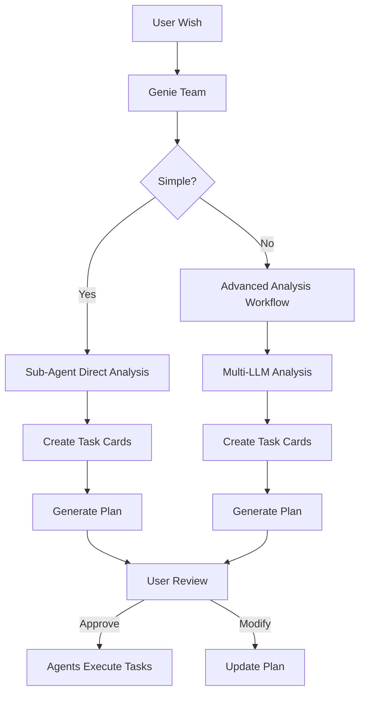

# 🏗️ Genie System Architecture - Context-Driven Design

## Core Architecture Principle: Context Through Files

```
genie-agents/
├── teams/
│   └── genie/
│       ├── team.py          
│       └── team.yaml        
├── agents/
│   ├── genie_planning/
│   ├── genie_analysis/
│   ├── genie_implementation/
│   └── ... (specialists)
├── workflows/
│   ├── wish_management/     # Creates/updates wish context files
│   ├── advanced_analysis/   # Complex multi-LLM analysis
│   └── ... (other workflows)
└── genie/                   # 🌟 SHARED CONTEXT VIA FILES
    ├── wishes/
    │   └── wish-[id]/
    │       ├── wish.md      # Main wish document
    │       ├── analysis.md  # Technical analysis
    │       ├── plan.md      # 📋 User-reviewable plan
    │       └── tasks/       # Individual task cards
    │           ├── task-001.md
    │           ├── task-002.md
    │           └── ...
    └── context/             # Shared knowledge
        ├── patterns.md      # Discovered patterns
        ├── decisions.md     # Architectural decisions
        └── memory.md        # Team memory
```

## Context Sharing Mechanism

### 1. **File-Based Context** (@filepath)
All agents and workflows are **stateless** but share context through files:

```python
# Any agent can reference context
analysis_context = "@genie/wishes/wish-auth-123/analysis.md"
current_plan = "@genie/wishes/wish-auth-123/plan.md"
task_001 = "@genie/wishes/wish-auth-123/tasks/task-001.md"
```

### 2. **Wish Structure** (Not Epic!)
```
Wish (Container)
├── Original Request
├── Analysis Results
├── Technical Plan (User-Reviewable)
└── Task Cards (Created During Analysis)
    ├── Task-001: [P] Design authentication
    ├── Task-002: [P] Research patterns
    ├── Task-003: [W:1,2] Implement
    └── Task-004: [S] Deploy
```

### 3. **Progressive Analysis Flow**



## Genie Team Leader (Updated)

```yaml
# teams/genie/team.yaml (key sections)

tools:
  - wish_management      # Create/update wish files
  - forward_task_to_member
  - Read                 # Read context files
  - Write                # Write context files
  
instructions: |
  **CONTEXT MANAGEMENT:**
  - All context shared via files in genie/ folder
  - Reference files with @genie/wishes/[wish-id]/...
  - Stateless operation - read context from files
  
  **WISH LIFECYCLE:**
  1. Create wish document in genie/wishes/[wish-id]/wish.md
  2. Delegate analysis to appropriate specialists
  3. Specialists create task cards in tasks/ folder
  4. Generate user-reviewable plan.md
  5. Present plan: "Here's my plan, would you like to change anything?"
  6. User can edit plan.md or request changes
  7. Execute approved plan
```

## Sub-Agent Context Access

```python
# agents/genie_planning/agent.py (example)

class GeniePlanningAgent(Agent):
    async def analyze_wish(self, wish_id: str):
        # Read wish context from file
        wish_content = await self.read_file(f"@genie/wishes/{wish_id}/wish.md")
        
        # Perform analysis
        analysis = await self.analyze(wish_content)
        
        # Create task cards based on complexity
        if analysis.complexity == "simple":
            # Direct task creation
            tasks = await self.create_task_cards(analysis)
            for i, task in enumerate(tasks):
                await self.write_file(
                    f"@genie/wishes/{wish_id}/tasks/task-{i+1:03d}.md",
                    task.to_markdown()
                )
        else:
            # Trigger advanced analysis workflow
            await self.trigger_workflow("advanced_analysis", {
                "wish_id": wish_id,
                "complexity": analysis.complexity
            })
        
        # Generate plan for user review
        plan = await self.generate_plan(wish_id)
        await self.write_file(
            f"@genie/wishes/{wish_id}/plan.md",
            plan
        )
```

## Task Cards & Parallel Execution

```markdown
# genie/wishes/wish-auth-123/tasks/task-001.md

## Task: Design Authentication Architecture
ID: task-001
Type: [P]  # Can run in parallel
Status: pending
Assigned: genie_architecture

### Description
Design JWT-based authentication system following existing patterns

### Acceptance Criteria
- [ ] Architecture diagram created
- [ ] Component interfaces defined
- [ ] Security considerations documented

### Context
- Wish: @genie/wishes/wish-auth-123/wish.md
- Analysis: @genie/wishes/wish-auth-123/analysis.md
- Patterns: @genie/context/patterns.md
```

Agents execute parallel tasks using Task tool directly:
```python
# Direct parallel execution by agents
parallel_tasks = [
    Task("Design auth architecture"),
    Task("Research security patterns"),
    Task("Review existing code")
]
# These run simultaneously
```

## User Review Process

```markdown
# genie/wishes/wish-auth-123/plan.md

# Technical Plan: Authentication System

## Overview
Add JWT-based authentication to the system using agent architecture

## Proposed Tasks

### Phase 1: Design & Research [2-3 hours]
- [ ] [P] Task-001: Design authentication architecture
- [ ] [P] Task-002: Research security best practices
- [ ] [P] Task-003: Review existing auth patterns

### Phase 2: Implementation [4-5 hours]
- [ ] [W:1,2,3] Task-004: Implement auth agent
- [ ] [S] Task-005: Add database migrations
- [ ] [S] Task-006: Create auth endpoints

### Phase 3: Testing & Deployment [2 hours]
- [ ] Task-007: Write comprehensive tests
- [ ] Task-008: Deploy to staging
- [ ] Task-009: Production deployment

## Architecture Decisions
- Use JWT for stateless auth
- PostgreSQL for user storage
- Agent-based auth handling

## Risk Assessment
- Low: Following established patterns
- Medium: New JWT library integration

---
📝 **To modify this plan**: Edit this file or tell me what changes you'd like
```

## Workflow Templates (Base Only)

```python
# workflows/wish_management/workflow.py
class WishManagementWorkflow(Workflow):
    """Creates and manages wish documents in genie/ folder"""
    pass

# workflows/advanced_analysis/workflow.py  
class AdvancedAnalysisWorkflow(Workflow):
    """Multi-LLM analysis for complex wishes"""
    pass

# Other workflows to be detailed later...
```

## Key Architecture Points

1. **Stateless Everything**: Agents/workflows read/write files for context
2. **File References**: Use @genie/... paths for context sharing
3. **Wish ≠ Epic**: Wish contains analysis, plan, and task cards
4. **User Iteration**: Plan.md is user-editable before execution
5. **Direct Parallelism**: Agents use Task tool, not workflow
6. **Progressive Complexity**: Simple = agent handles, Complex = workflow assists

Ready to detail the Genie team implementation and sub-agents with this corrected architecture?