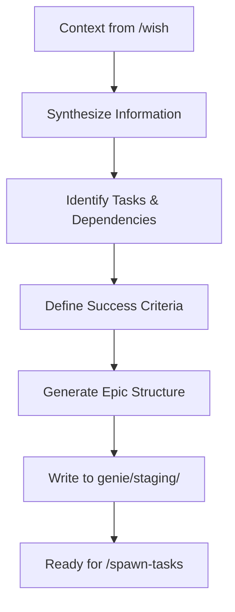

# /epic

---
allowed-tools: Task(*), Read(*), Write(*), Edit(*), MultiEdit(*), Glob(*), Grep(*), Bash(*), LS(*), NotebookRead(*), NotebookEdit(*), WebFetch(*), TodoWrite(*), WebSearch(*), ListMcpResourcesTool(*), ReadMcpResourceTool(*), mcp__zen__chat(*), mcp__zen__thinkdeep(*), mcp__zen__planner(*), mcp__zen__consensus(*), mcp__zen__codereview(*), mcp__zen__precommit(*), mcp__zen__debug(*), mcp__zen__secaudit(*), mcp__zen__docgen(*), mcp__zen__analyze(*), mcp__zen__refactor(*), mcp__zen__tracer(*), mcp__zen__testgen(*), mcp__zen__challenge(*), mcp__zen__listmodels(*), mcp__zen__version(*), mcp__search-repo-docs__*, mcp__ask-repo-agent__*, mcp__wait__*, mcp__send_whatsapp_message__*
description: Internal command for structuring epics from gathered context (used by Claude, not users)
---

🚧 **DEVELOPMENT MODE** 🚧
Internal command used by Claude to structure epics after context gathering.

## Purpose

The `/epic` command is used internally by Claude after `/wish` has gathered all necessary context. It structures the information into a comprehensive epic document ready for task generation.

## Internal Workflow



## Input Context Structure

When called internally, `/epic` expects:

```python
epic_context = {
    "wish": "Original user wish",
    "type": "epic|feature|bug|refactor",
    "analysis": {
        "scope": "What's included",
        "complexity": "simple|medium|complex",
        "domain": "framework|agents|infrastructure"
    },
    "consultation": {
        "gemini_insights": "Architecture recommendations if consulted",
        "pattern_matches": ["relevant patterns from reference/"],
        "doc_references": ["relevant documentation"]
    },
    "user_responses": {
        "architecture": "User's technical preferences",
        "scope": "In/out of scope clarifications",
        "success": "How they define success"
    },
    "technical_context": {
        "affected_files": ["list of files"],
        "current_state": "What exists now",
        "desired_state": "What should exist"
    }
}
```

## Epic Generation Process

### 1. Information Synthesis

Combines all context into coherent understanding:
- User's wish and intent
- Technical requirements and constraints
- Architectural insights from consultations
- Existing patterns and code

### 2. Task Decomposition

Breaks work into logical, atomic tasks:
- Each task has single responsibility
- Tasks are sized for single agent work
- Dependencies are explicitly mapped
- Parallel work opportunities identified

### 3. Dependency Mapping

Creates clear task flow:
```
task-001 → task-002 → task-004
         ↘ task-003 ↗
```

### 4. Success Criteria Definition

Converts user's definition into measurable outcomes:
- Functional requirements
- Performance metrics
- Quality standards
- User experience goals

## Epic Document Structure

```markdown
# Epic: [Generated Title]
*Generated from wish: "[original wish]"*

## Metadata
- **Epic ID**: [kebab-case-id]
- **Type**: [epic|feature|bug|refactor]
- **Priority**: [high|medium|low]
- **Branch**: [epic-id]
- **Created**: [timestamp]
- **Status**: draft

## Overview
[Comprehensive description synthesized from all context]

## Context & Background
### Current State
[What exists now, pain points, manual processes]

### Desired State
[Vision of success, automated flows, improvements]

### Technical Context
- **Architecture Decision**: [From Gemini/analysis]
- **Pattern References**: [From reference/]
- **Key Constraints**: [Technical limitations]

## Scope
### In Scope
[Explicit list from user clarification]

### Out of Scope
[What we're NOT doing]

### Future Considerations
[What could come next]

## Tasks
[Generated with T-### format for easy parsing]

T-001: Design reference resolver architecture
- Description: Create extensible system for #epic/#task parsing
- Acceptance: Architecture doc with parser design
- Estimate: 2-3 hours
- Dependencies: none

T-002: Implement reference parser
- Description: Build regex-based parser for references
- Acceptance: All reference types parse correctly
- Estimate: 3-4 hours
- Dependencies: T-001

[Continue for all tasks...]

## Task Dependencies
```
T-001 → T-002 → T-004
      ↘ T-003 ↗
```

## Success Criteria
[Measurable outcomes from user input]
- [ ] Reference syntax works: #epic:current, #task:id
- [ ] Zero manual context loading required
- [ ] All agents auto-receive context
- [ ] Performance: <50ms resolution time

## Technical Specifications
[Detailed from analysis and consultation]

## Risk Assessment
[Identified risks and mitigation strategies]

## References
[All relevant files and documentation]

## Approval
- [ ] Epic structure approved
- [ ] Ready for task generation
```

## Automation Integration

The epic file is written to `genie/staging/[epic-id].md` which:
1. Triggers validation hook
2. Awaits user approval
3. Once approved, triggers `/spawn-tasks`

## Quality Checks

Before writing the epic, validate:
- [ ] All tasks are atomic and clear
- [ ] Dependencies make logical sense
- [ ] Success criteria are measurable
- [ ] Scope is well-defined
- [ ] Technical approach is sound

## Development Notes

Since we're building this:
1. Start with simple epic generation
2. Test task decomposition logic
3. Refine dependency mapping
4. Add validation layers
5. Integrate with hooks

The goal: Transform messy human wishes into pristine, actionable epics that agents can execute flawlessly.

---

🚧 **Internal Use Only**: This command is called by Claude during the /wish workflow, not directly by users.